# Provision Azure relational database services

As part of your role at Contoso as a data engineer, you've been asked to create and configure SQL Server, PostgreSQL, and MySQL servers for Azure.

Select a region from the following list when you create resources:

-   West US 2
-   South Central US
-   Central US
-   East US
-   West Europe
-   Southeast Asia
-   Japan East
-   Brazil South
-   Australia Southeast
-   Central India

### Task 1: Create your Azure SQL Database service
  --------------------------------------

In this task you'll set up your Azure SQL Database instance, which includes creating your server.

Over time if you realize you need additional compute power to keep up with demand, you can adjust performance options or even switch between the DTU and vCore performance models.

1.  Open Edge Browser and log in to the Azure portal. When prompted, use the credentials provided within the Environment Details tab of the lab guide.

    
    
---
**NOTE**-
 The DeploymentID (Unique Id) can be found from the Environment Details page.

---

2.  In the portal, select Create a resource from the upper left-hand corner. Select Databases, then select SQL Database.

    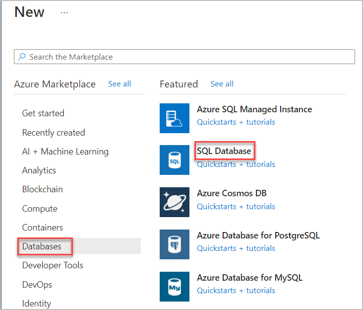

3.  Enter the following values into the form:

    | Setting | Value  |
    | --- | --- |
    | Subscription | **Default Subscription** |
    | Resource group | **DP900-DID** |
    | Database name | **ContosoDID**, Where **DID** is the DeploymentID (Unique Id) which can be found from the Environment Details page. |
    | Want to use SQL elastic pool? | **No** |

    

4.  Under Server, select Create new, fill out the form with the following values, and then select OK:

    | Setting | Value  |
    | --- | --- |
    | Server name | **sqlDID** ,Where **DID** is the DeploymentID (Unique Id) which can be found from the Environment Details page. |
    | Server admin login | **azureadmin** |
    | Password | **Pa55w.rd** |
    | Confirm password | **Pa55w.rd** |
    | Location | **Select the default location** |
    
    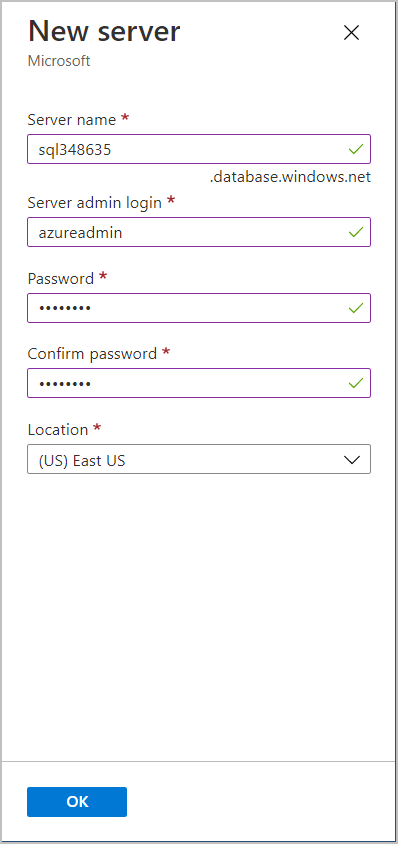

5.  Under Compute + storage, select Configure database.

6.  On the General Purpose tab, leave vCores set to **2**, change Data max size to **50 GB**, and then select Apply.

7.  Back on the Create SQL Database page, select Additional settings.

8.  Use these values to fill out the form.

    | Setting | Value  |
    | --- | --- |
    | Use existing data | **None** |
    | Database Collation | **SQL_Latin1_General_CP1_CI_AS** |
    | Maintenance window | **Default** |

    

9.  Select Review + Create, and then select Create to create your Azure SQL database.

10. On the toolbar, select Notifications to monitor the deployment process.

    When the process completes, select Pin to dashboard to pin your database server to the dashboard so that you have quick access when you need it later.
    
    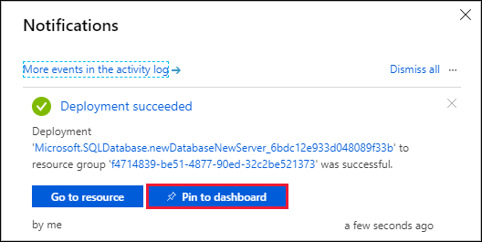
    

### Task 2: Create your Azure Database for PostgreSQL service (Optional)
 -------------------------------------------------

In this exercise, you'll set up Azure Database for PostgreSQL

1.  Open Edge Browser and log in to the Azure portal. When prompted, use the credentials provided within the Environment Details tab of the lab guide.

2.  In the portal, select Create a resource from the upper left-hand corner. Select Databases, then select Azure Database for PostgreSQL.

    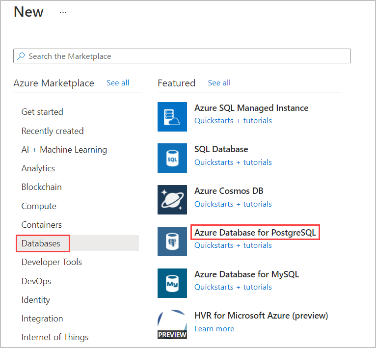

3.  You will be presented with the choice of a **Single server** or **Hyperscale**. Select Create for the Single server option

    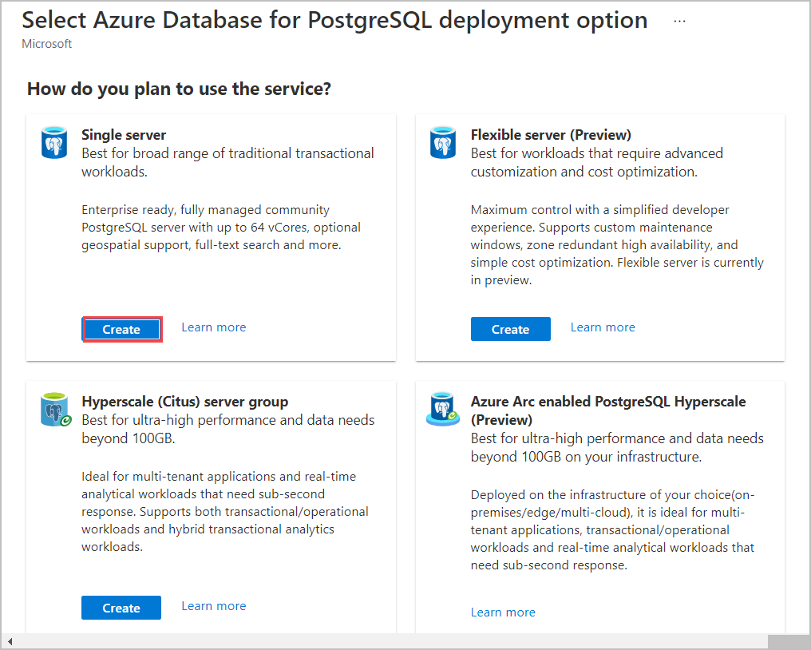

4.  Use these values to start filling out the form.

    | Setting | Value  |
    | --- | --- |
    | Subscription | **Default Subscription** |
    | Resource group | **DP900-DID** |
    

5.  Under Server details, use these values

    | Setting | Value  |
    | --- | --- |
    | Server name | Enter **postgresqlDID**, Where **DID** is the DeploymentID (Unique Id) which can be found from the Environment Details page. |
    | Data source | **None** |
    | Location | **Select the default location** |
    | Version | **Keep default setting** |
    
    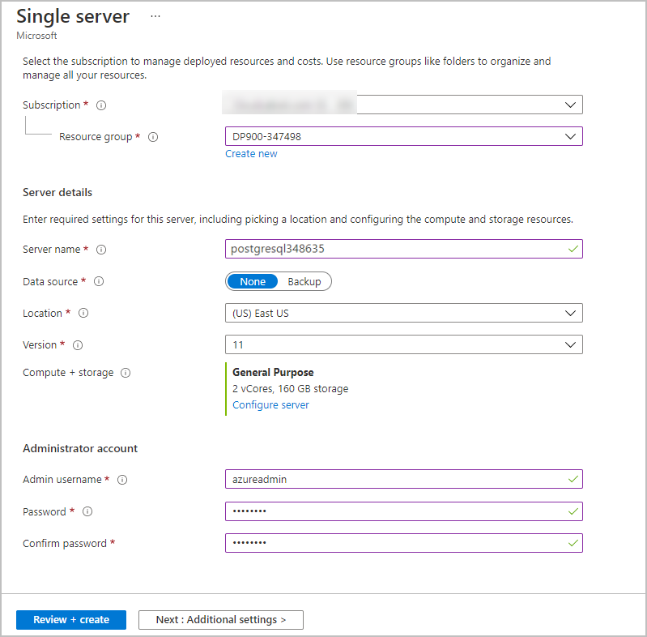

6.  Under Compute + storage, select Configure server.

7.  Change vCore to **two cores**, increase the storage to **160 GB**, set the Backup Retention Period to **14 days**, and then select OK.
    
    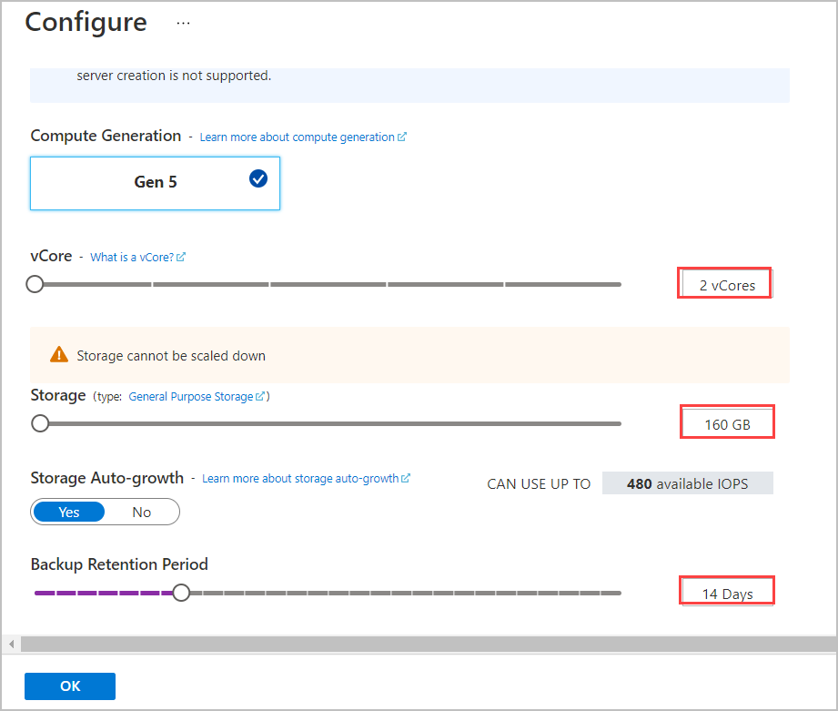

8.  Back on the Single server page, under Administrator account, specify these values:

    | Setting | Value  |
    | --- | --- |
    | Admin username | **azureadmin** |
    | Password | **Pa55w.rd** |
    | Confirm password | **Pa55w.rd** |

9.  Select Review + Create, and then select Create to create your Azure PostgreSQL database.

10. On the toolbar, select Notifications to monitor the deployment process.

    When the process completes, select Pin to dashboard to pin your database server to the dashboard so that you have quick access when you need it later.
    
    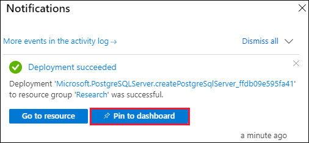
    
### Task 3 : Create your Azure Database for MySQL service (Optional)
 --------------------------------------------

In this exercise you'll set up Azure Database for MySQL

1.  Sign into the [Azure portal](https://portal.azure.com/learn.docs.microsoft.com) using the same account you activated the sandbox with.

2.  From the portal, select Create a resource from the upper left-hand corner. Select Databases, then select Azure Database for MySQL.

    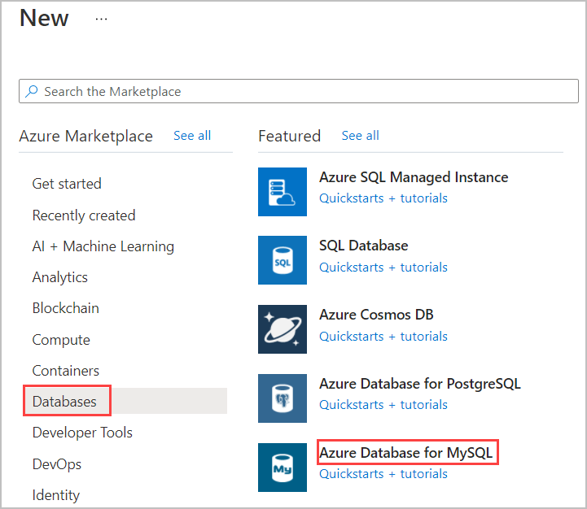

3.  Use these values to fill out the first section of the form.

    | Setting | Value  |
    | --- | --- |
    | Subscription | **Default Subscription** |
    | Resource group | **DP900-DID** |

4.  Under Server details, use these values

    | Setting | Value  |
    | --- | --- |
    | Server name | Enter **mysqlDID**, Where **DID** is the DeploymentID (Unique Id) which can be found from the Environment Details page. |
    | Data source | **None** |
    | Location | **Select the default location** |
    | Version | **Keep default setting** |

    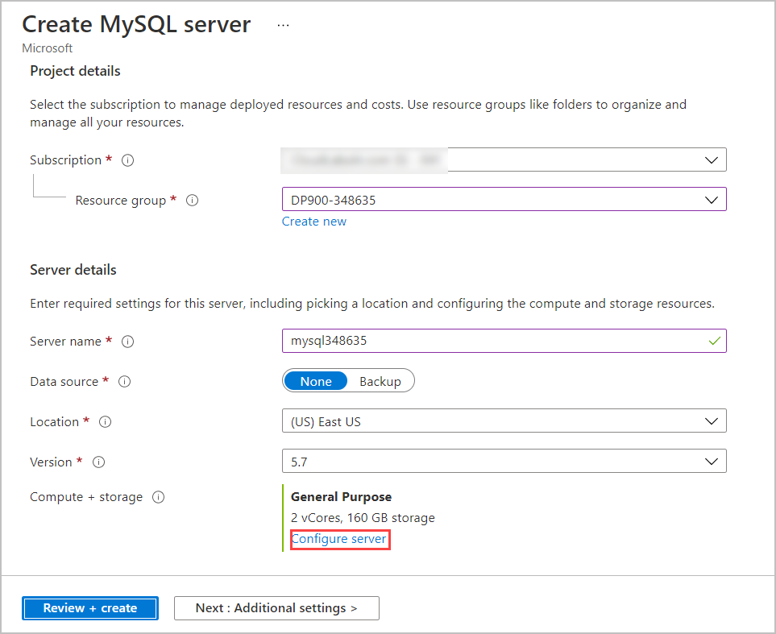

5.  Under Compute + storage, select configure server.

6.  On the Pricing tier page, reduce vCore to **two cores**, set Storage to **160 GB**, change Backup Retention Period to **14 days**, and then select apply.

    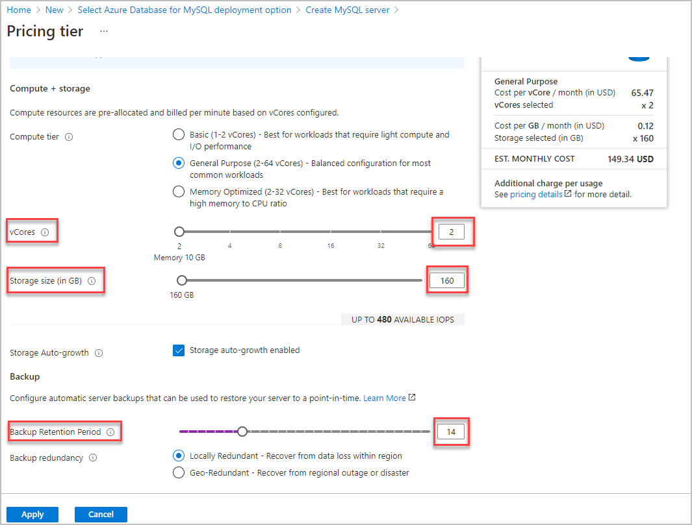 

7.  Back on the Create MySQL server page, under Administrator account, use these values

    | Setting | Value  |
    | --- | --- |
    | Admin username | **azureadmin** |
    | Password | **Pa55w.rd** |
    | Confirm password | **Pa55w.rd** |

8.  Select Review + Create, and then select Create to create your Azure MySQL database.

9.  On the toolbar, select Notifications to monitor the deployment process.

    When the process completes, select Pin to dashboard to pin your database server to the dashboard so that you have quick access when you need it later.

    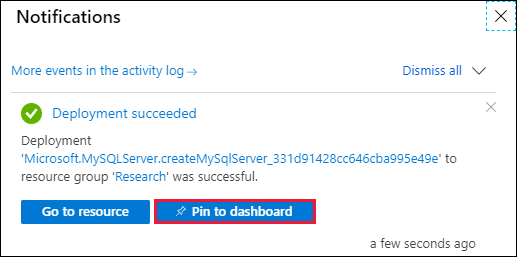
