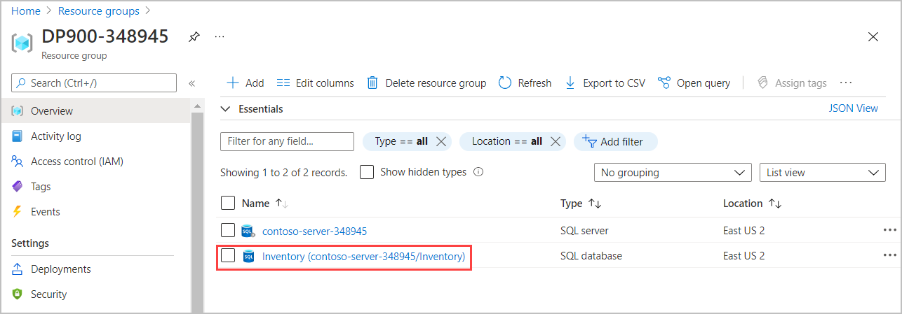
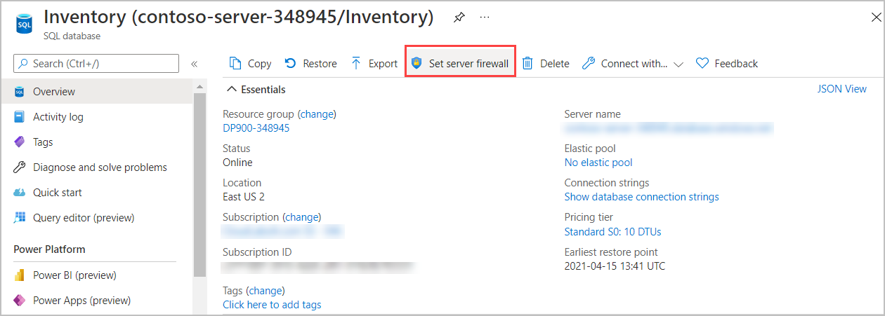
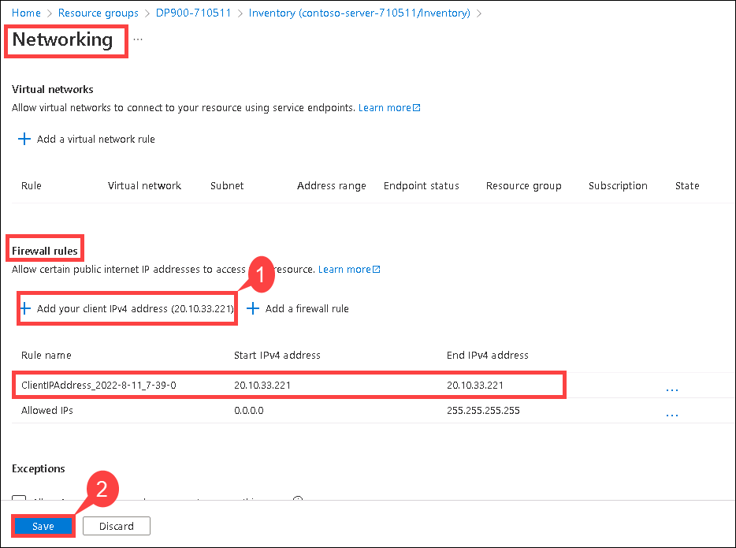
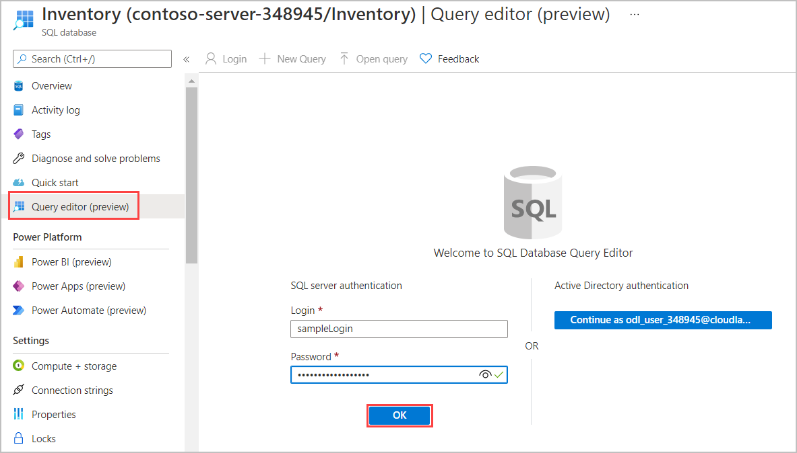
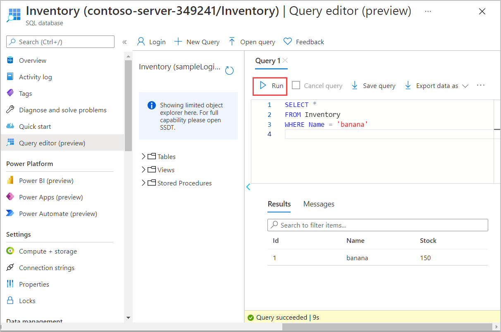
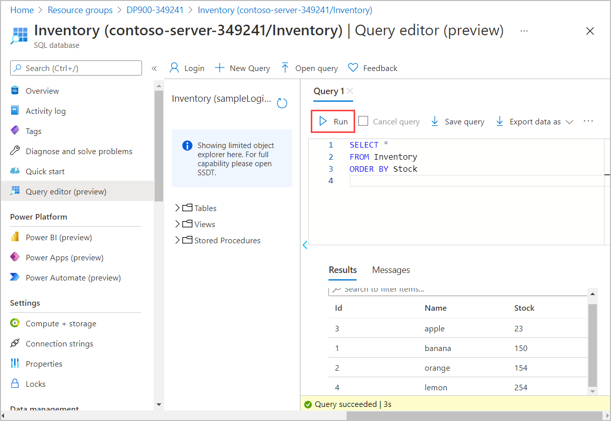
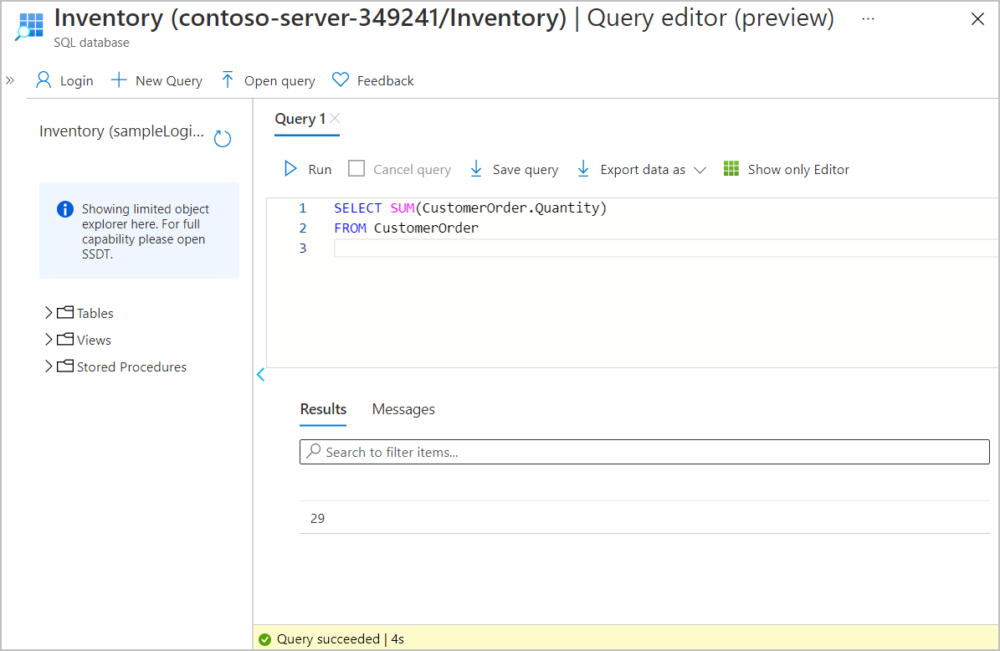

# Use SQL to query Azure SQL Database

Contoso has provisioned the SQL database and has imported all the inventory data into the data store. As lead developer, you've been asked to run some queries over the data.

In this exercise, you'll query the database to find how many products are in the database, and the number of items in stock for a particular product.

## Task 1: Connect to the query editor

You'll use the built-in Query editor in the Azure portal to connect to the database and query the data.

1. Open **Edge Browser** and log in to the **Azure portal**. When prompted, use the credentials provided within the **Environment Details** tab of the lab guide.

    
    
    >**NOTE**: DeploymentId can be obtained from the Lab Environment output page.

2. In the portal, on the home page select **Resource groups**, and then select **DP900-DID** resource group, where **DID** is the DeploymentId can be obtained from the Lab Environment output page.

    
    
3. Select the **Inventory SQL database**. 
    
    

4. On the Overview page for your database, select **Set server firewall**.

    
    
5. On the **Networking** page, under Firewall rules select **Add client IP (1)**, and then select **Save (2)**.

    

6. Close the **Networking** settings page, and return to the Overview page for your database.

7. On the Overview page, select **Query editor (preview)** in the left menu.

8. Enter the **administrator login** and **administrator password**, this can be found from the **environment details** tab under this resource group **DP900-DID**. Select **OK**.

    

    You'll be presented with a screen similar to this example:

    
    
    >**Note**: Adding your client IP in this step will not account for any existing VPN connections. If you can't complete step 7, disable any VPN connections or add the additional IP address manually from any errors displayed.

## Task 2: Run queries against the database

1. Copy the following SQL statement into the editor. Select **Run**, to check everything is working. You should see a list of four inventory items

    ```
    SELECT *
    FROM Inventory

    ```

    

2. Replace the current SQL statement with the following statement to only show the number of bananas in stock:

    ```
    SELECT *
    FROM Inventory
    WHERE Name = 'banana'

    ```

    There should be 150 bananas.

    

3. Replace the SQL statement with the following statement to retrieve the inventory items in order of the quantity in stock:

    ```
    SELECT *
    FROM Inventory
    ORDER BY Stock

    ```

    

4. Replace the SQL statement with the statement shown below. This statement is a query that uses the JOIN operator to combine data from the **CustomerOrder** table and the **Inventory** table. It lists the details of orders placed by customers together with the inventory information for each item ordered:

    ```
    SELECT *
    FROM Inventory
    JOIN CustomerOrder ON Inventory.Id = CustomerOrder.InventoryId

    ```

    

5. Change the query to find the names of all customers who have ordered oranges.
  
    ```
    SELECT CustomerOrder.CustomerName
    FROM CustomerOrder
    JOIN Inventory ON CustomerOrder.InventoryId = Inventory.ID
    AND Inventory.Name = 'orange'

    ```

    This query should return two customers: **John Smith** and **Jane Brown**.

6. Find out how many customers have ordered lemons. This query uses the ```COUNT(*)``` function, which returns the number of rows that match the query criteria.

    ```
    SELECT COUNT(*)
    FROM CustomerOrder
    JOIN Inventory ON CustomerOrder.InventoryId = Inventory.ID
    AND Inventory.Name = 'lemon'

    ```

    The results of this query should indicate that only **one** customer has ordered lemons.

7. Which fruits has John Smith ordered?

    ```
    SELECT Inventory.Name
    FROM CustomerOrder
    JOIN Inventory ON CustomerOrder.InventoryId = Inventory.ID
    AND CustomerOrder.CustomerName = 'John Smith'

    ```

    The results of this query should show that John Smith has only ordered **oranges**.

8. What is the total quantity of items ordered by all customers? The **Quantity** column in the **CustomerOrder** table contains the quantity for each order. This query uses the SUM aggregate function to add the quantities together to product a grand total:

    ```
    SELECT SUM(CustomerOrder.Quantity)
    FROM CustomerOrder
    ```

    The answer should be **29**.
    
    
    
You've now seen how to run SQL queries against a SQL database. If you have time, try to add some more rows into both tables using INSERT statements, modify the rows using UPDATE statements, and remove rows using DELETE statements.

## Congratulation, you have completed this lab.
------------
