# Provision non-relational Azure data services

In the sample scenario, you've decided to create the following data stores:

-   A Cosmos DB for holding information about the volume of items in stock. You need to store current and historic information about volume levels, so you can track how levels vary over time. The data is recorded daily.
-   A Data Lake store for holding production and quality data.
-   A blob container for holding images of the products the company manufactures.
-   File storage for sharing reports.

In this exercise, you'll provision and configure the Cosmos DB account, and test it by creating a database, a container, and a sample document. You'll also provision an Azure Storage account that can provide blob, file, and Data Lake storage.

You'll perform this exercise using the Azure portal.


 >Note: Azure can take as little as 5 minutes or as long as 20 minutes to create the Azure Cosmos DB account.


## Task 1: Provision and configure a Cosmos DB database and container

## Step 1 : Create a Cosmos DB account

1.  Open Edge Browser and log in to the Azure portal. When prompted, use the credentials provided within the Environment Details tab of the lab guide.

    

 >**Note** - The DeploymentID can be obtained from the Lab Environment output page.

2.  From the left-hand navigation menu in the Azure portal, select Create a resource.

    

3.  On the create a resource page, select Azure Cosmos DB.

    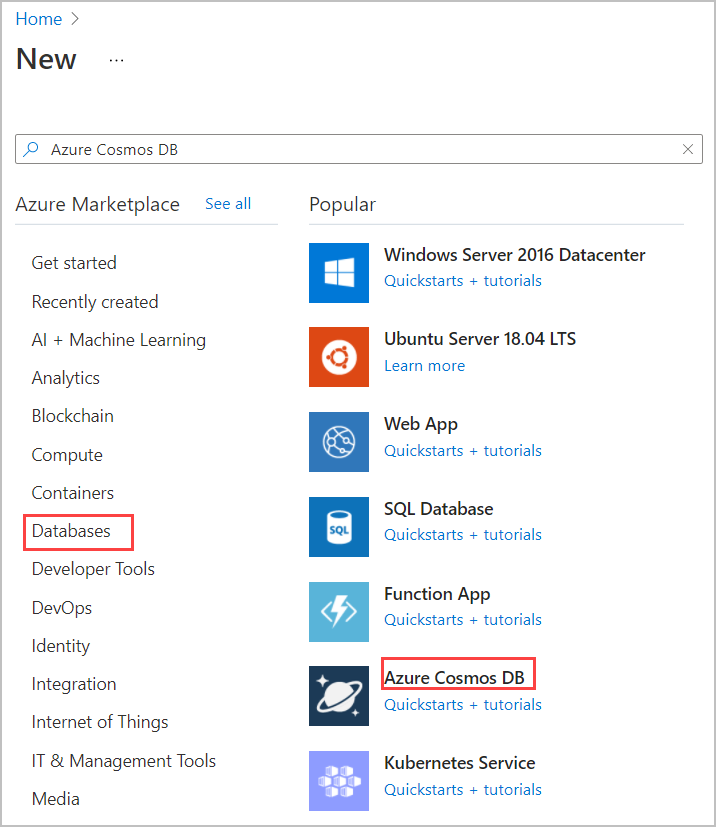
    
4. On the select API Option, select the **Core (SQL)**. 

5.  On the Create Azure Cosmos DB Account page, on the Basics tabs, enter the details of the account using the values in the following table, and then select **Next**.

    | Field | Value |
    | --- | --- |
    | Subscription | **Default Subscription** |
    | Resource Group | **DP900-DID** |
    | Account Name | **cosmosdbaccountDID**, Where **DID** is the DeploymentID can be obtained from the Lab Environment output page. |
    | Location | **Accept the default location** |
    | Capacity mode | **Provisioned throughput** |
    | Apply Free Tier Discount | **Do Not Apply** |
       
- Note  Where **DID** is the DeploymentID can be obtained from the Lab Environment output page.

    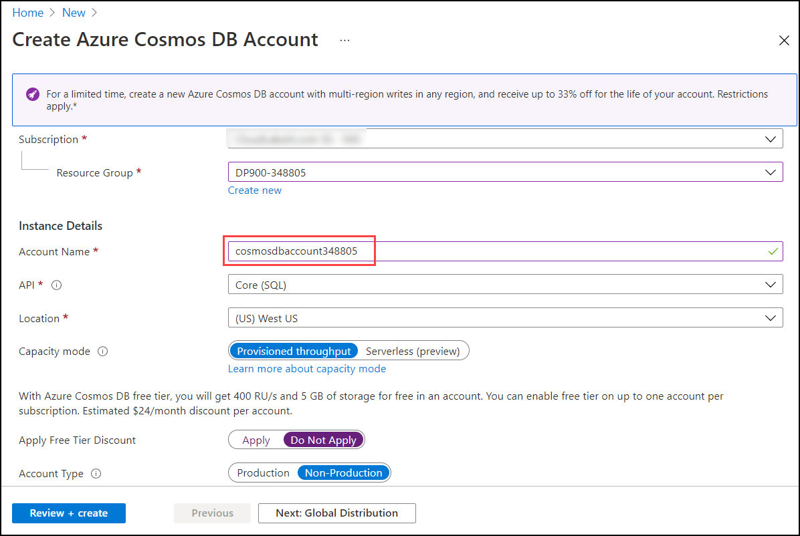

6. enter the details of the account using the values in the following table and then, Selelct **Review + create:**
   
    | Field | Value |
    | --- | --- |
    | Geo-Redundancy | **Disable** |
    | Multi-region Writes | **Disable** |   
    
    

7.  Wait while your settings are validated. If there's a problem, it will be reported at this stage, and you can go back and correct the issue.

8.  Select Create. It can take 10 or 15 minutes to create the account.

    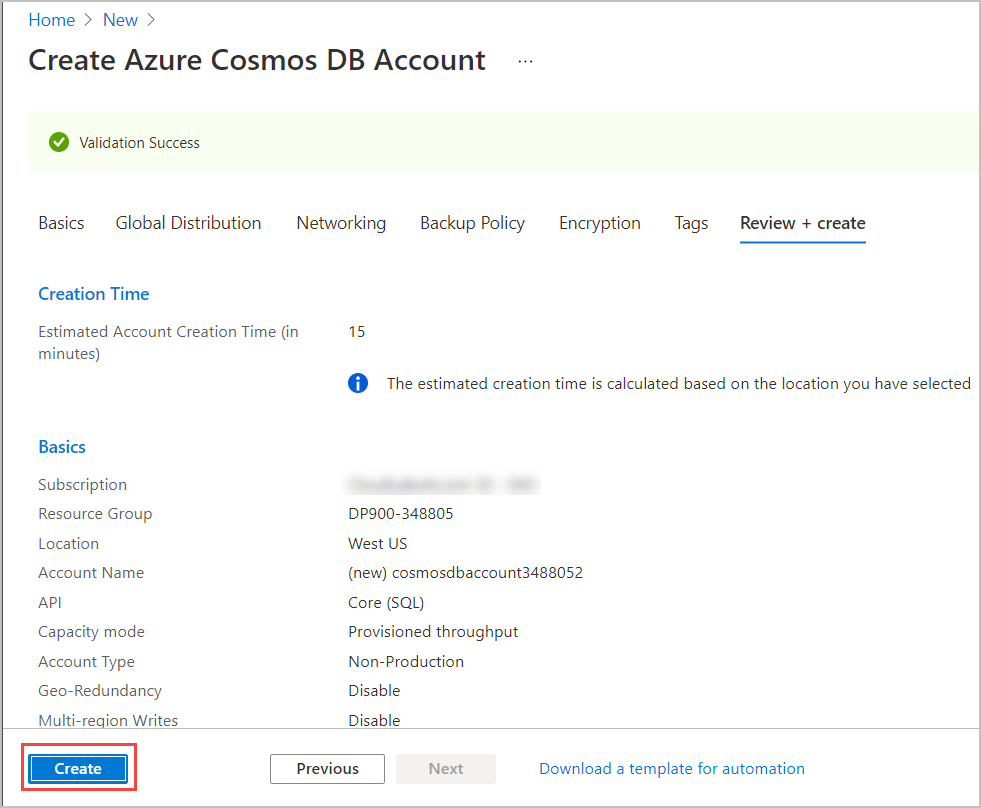
    
## Step 2 : Create a database and a container

1.  In the Azure portal, in the left-hand navigation menu, select All resources, and then select your Cosmos DB account.

    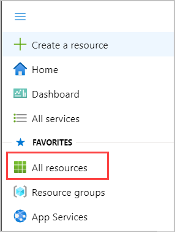

2.  On the page for your Cosmos DB account, select **Data Explorer**.

    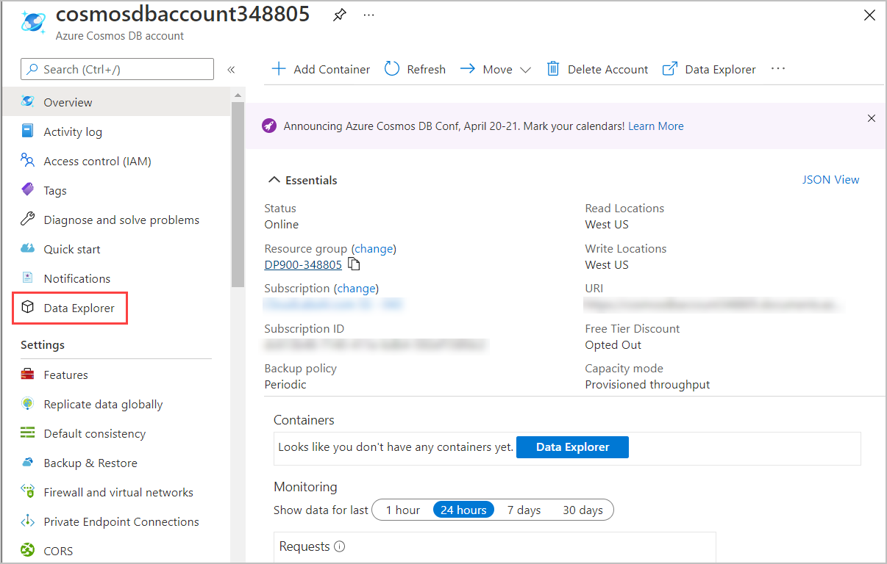

3.  On the Data Explorer page, select **New Container**.

    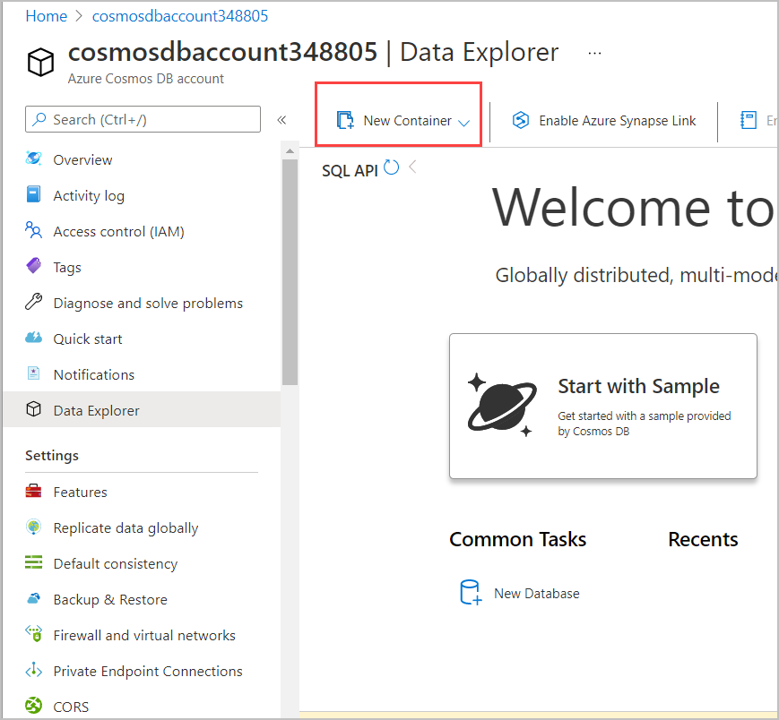

4.  In the Add Container dialog box, create a new container with the following values, and then select **OK**:

    | Field | Value |
    | --- | --- |
    | Database ID | Select Create new, and enter **contosodb** |
    | Share database throughput | **Check** |
    | Throughput | Select **Manual**, and specify **400** RU/s (the default) |
    | Container ID | **productvolumes** |
    | Partition key | **/productid** (Each product will have a new level recorded each day. Partitioning by product ID enables you to quickly report how the levels for a product vary over time.) |
    | My partition key is larger than 100 bytes | **Leave unchecked** |

    

5.  In the Data Explorer window. Expand contosodb, expand productvolumes, and then click **Items**. The container should currently be empty.

    

6.  Select **New Item** to create a new document.

    

7.  Replace the text that appears in the document window with the following JSON document. This is an example document showing the amount of product 99 in stock on 01/01/2020.

    JSONCopy

    ```
    {
        "productid": 99,
        "date": "01/01/2020",
        "in-stock": 500
    }

    ```

8.  Select Save. The document will be added to the container. The new document will have some additional fields that Cosmos DB uses to track and manage the document. You can ignore these fields for now.

    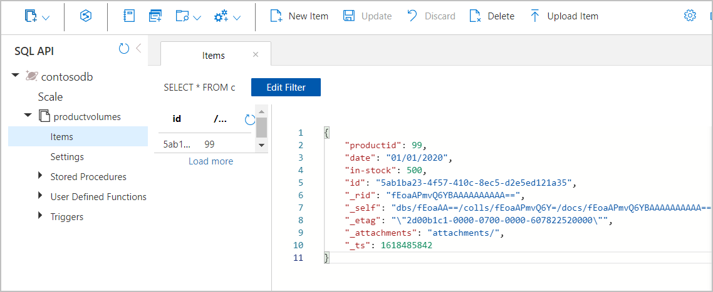

You've now provisioned a new Cosmos DB account, and created a database and container.

## Task 2 : Provision Azure Storage

## Step 1 : Create an Azure Storage account for Data Lake Storage

1.  On the left-hand navigation menu in the Azure portal, select Create a resource.

    
    
2.  On the create a resource, select Storage account - blob, file, table, queue.

    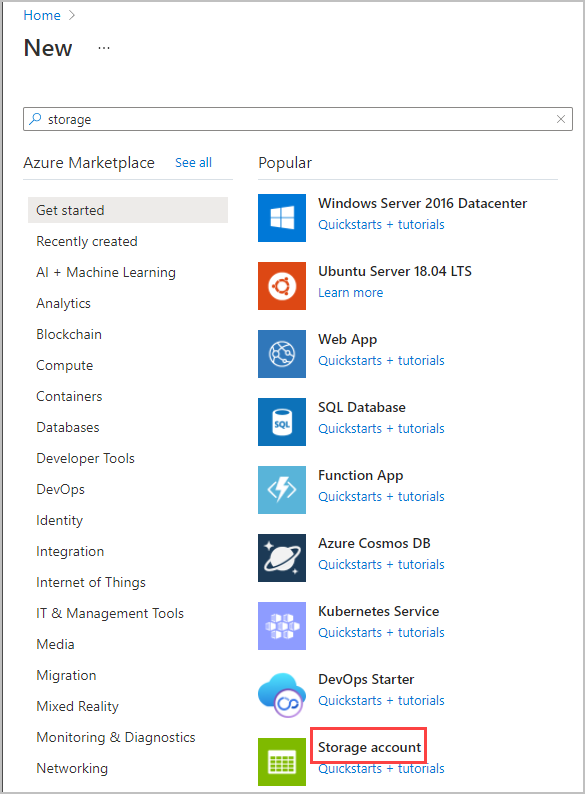

3.  On the Create storage account page, on the Basics tabs, enter the details of the account using the values in the following table:

    | Field | Value |
    | --- | --- |
    | Subscription | **Default Subscription** |
    | Resource Group | **DP900-DID** |
    | Storage account Name | **datastorageDID**, Where **DID** is the DeploymentID can be obtained from the Lab Environment output page. |
    | Performance | **Standard** |
    | Replication | **Geo-Zone-redundant storage (GZRS)** |
    | Access tier | **Hot** |
    
  >Note  Where **DID** is the DeploymentID can be obtained from the Lab Environment output page.

   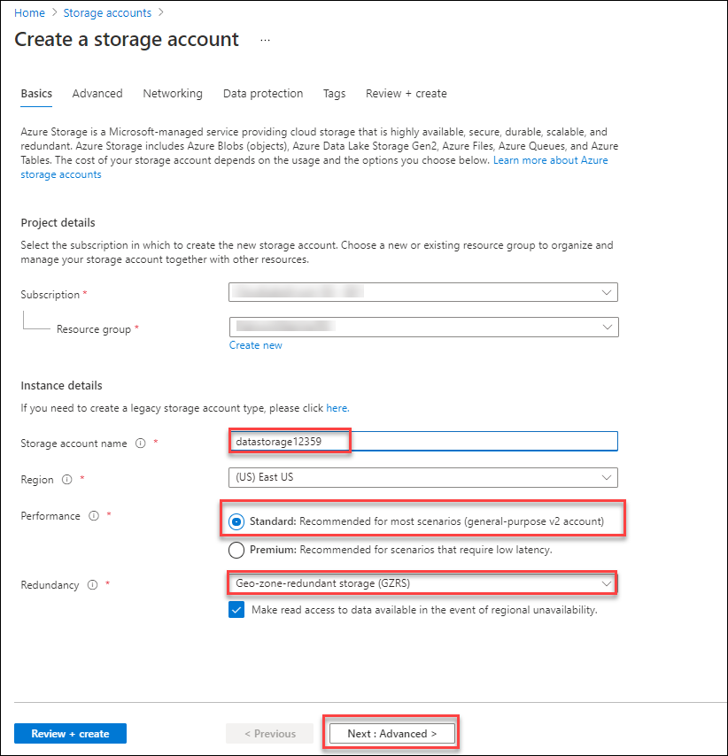

4.  Select Advanced. On the Advanced page, in the Data Lake Storage Gen2 section, select Enabled, and then select Review + create.

     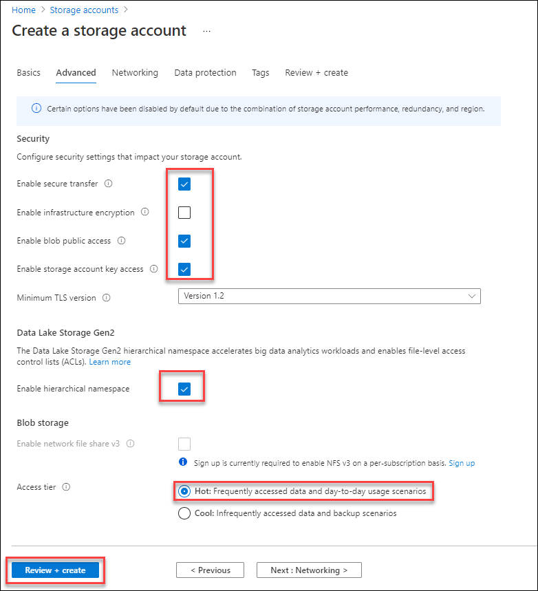

5.  If your settings are validated correctly, select Create.

    It takes approximately 15-20 seconds for the storage account to be provisioned.

## Step 2 : Create a container for Data Lake storage

1.  In the Azure portal, on the left-hand navigation menu, select All resources, and then select your storage account.

2.  On the page for your storage account, under Data Lake Storage, select **Containers**.

    

3.  On the Containers page, select + Container, and create a new container named **productqualitydata**. Leave the Public access level set to **Private (no anonymous access)**, and then click Create.

    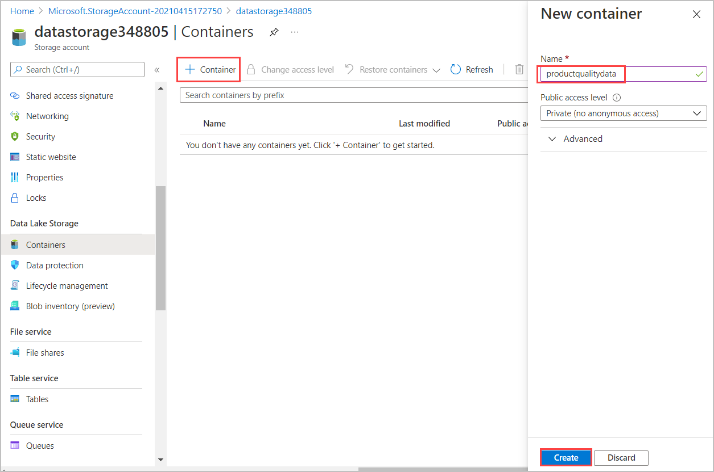

4.  When the container has been created, double-click the **productqualitydata** container.

5.  On the productqualitydata page, click + Add Directory, and add a directory named **plantA**.

    

6.  Add a second directory named **plantB**.

    Contoso has two manufacturing plants named **Plant A** and **Plant B**. Other applications will upload manufacturing data from each of these plants to the appropriate directory for later analysis.


## Step 3 : Create a container for Blob storage

1.  In the Azure portal, on the left-hand navigation menu, select All resources, and then select your storage account.

2.  On the Overview page, select Containers.

    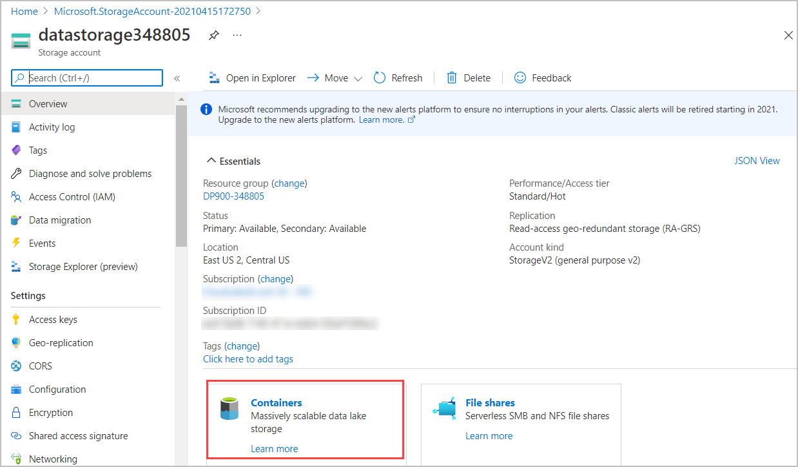

3.  On the Containers page, select + Container, and create a new container named **images**. Set the Public access level to **Blob (anonymous read access for blobs only)**.

    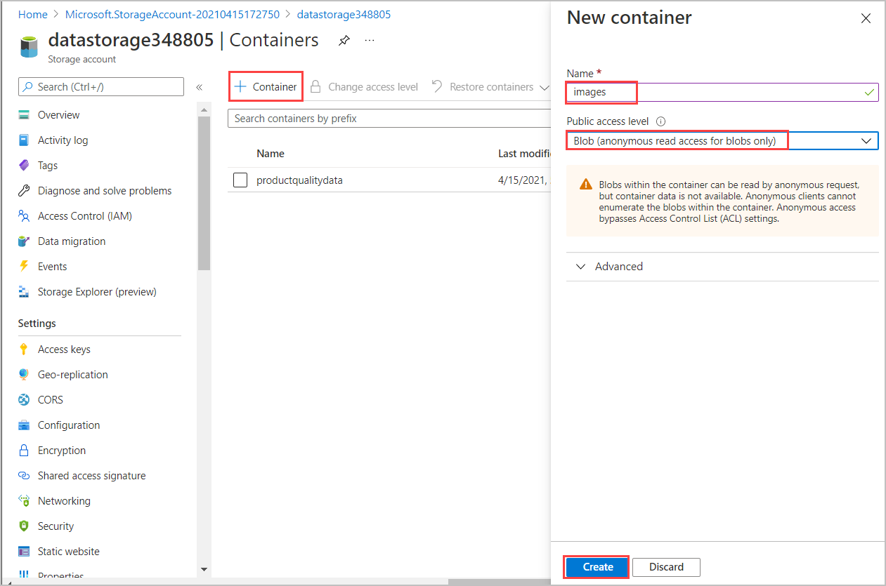
    
    Contoso will use this container to hold product images.


 >Note: The container created for Data Lake Storage will also appear in the Containers page. You could store image data in a Data Lake Storage container, but Contoso want to keep the images separate from product quality data.


## Step 4 : Create a file share

1.  On the storage account page, under File service select **File shares**.

    

2.  On the File shares page, select + File share, create a new file share named **reports**. Leave the Quota **empty** and Tier as **Transaction optimized** and click on Create.

    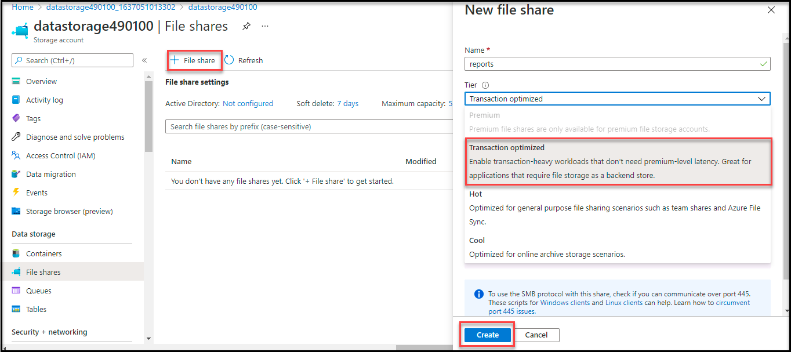 
    
3.  On the File shares page, double-click the reports file share.

4.  On the reports page, select + Add directory, and add a directory named **manufacturing**.

    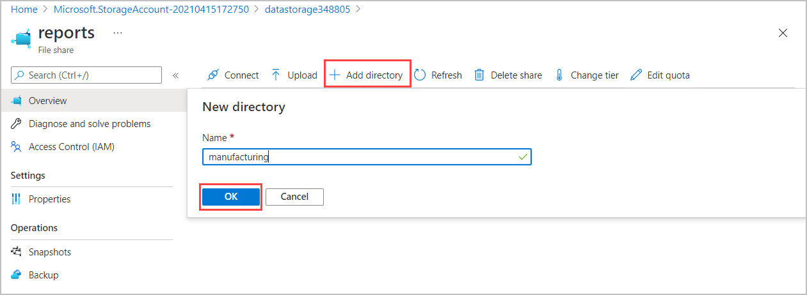

5.  Add a second directory named **complaints**.

    Contoso will use these directories to hold documents relating to the manufacturing process and customers' complaints. A user that has been granted access to the reports file share can upload and download files from these directories.
