# Upload, download, and query data in a non-relational data store

In this exercise, you'll upload data to these data stores. You'll run queries against the data in the Cosmos DB database. Finally, you'll download and view the images and documents held in Azure Storage.


### Task 1: Upload product data to Cosmos DB
--------------------------------

1.  Sign in to the [Azure portal](https://portal.azure.com/learn.docs.microsoft.com) using the credentials provided in the Environment details page from the left side.

2.  On the home page, select Azure Cosmos DB.

    

3.  On the Azure Cosmos DB page, select the Cosmos DB account with name cosmos{deploymentID} present in the page.

    

4.  On the Cosmos DB account page, under Settings, select Keys. Copy the PRIMARY CONNECTION STRING to the clipboard.

    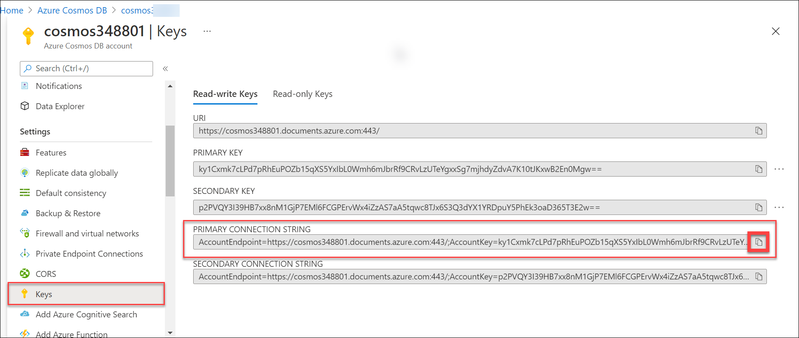

5.  Switch to your desktop computer.

6.  Open a command prompt window, navigate to desktop using the cd command, and run the second command to create another copy of the code and data required for the exercise.

       >**Note**: You need a copy of the data on your computer because you'll run the tools to upload this data from your desktop.

     ```
        cd desktop
        
        git clone https://github.com/MicrosoftDocs/mslearn-explore-non-relational-data-stores-azure.git lab

     ```

    
7.  On the desktop, Double-click the file dtui.exe. This application is the Data Migration Tool.

    

8.  On the Welcome page of the Data Migration Tool, select Next.

    

9. On the Source Information page, in the Import from drop-down list box, select JSON file(s). and then select Add Files.

    

10. In the Open dialog box, browse to the folder on the desktop where you cloned the repository containing the sample data for the exercise, move to the lab folder, move to the products folder, and select the productinfo.json file. Select Open.

    ```
      Note: The productinfo.json file contains the product information in JSON format. If you have time, you can examine the contents of this file using Notepad.
    ```

    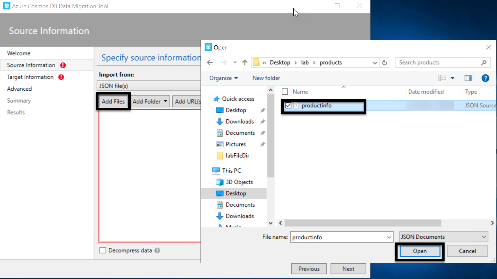
11. Back on the Source Information page, select Next

12. On the Target Information page, enter the following settings, and then select Next.

    TABLE 1
    | Field | Value |
    | --- | --- |
    | Export to | Azure Cosmos DB - Sequential record import (partitioned collection) |
    | Connection String | Paste the primary connection string from the clipboard, and append the text *database=ProductData* to the end of the string, after the semi-colon ( ; ) character. |
    | Collection | ProductCatalog |
    | Partition Key | /productcategory/subcategory |
    | Collection Throughput | 1000 |
    | ID | *leave empty* |

    

13. On the Advanced page, leave all settings at their default values, and then select Next.

    

14. On the Summary page, select Import.

    

15. Wait while the import proceeds. It should complete without any errors or warnings, and report that it has transferred 504 records.

    

16. Close the Data Migration Tool.

### Task 2: Query product data in Cosmos DB
-------------------------------

1.  Return to the Azure portal, and go to your Cosmos DB account.

2.  On the Overview page for the account, select Data Explorer. On the Data Explorer page, expand the ProductData database, expand the ProductCatalog container, and then select Items. Verify that the Items pane contains a list of products.

    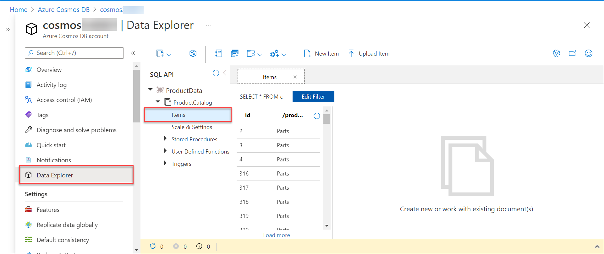

3.  Select the item with ID 316. A JSON document containing the details for product 316 should appear in the right-hand pane.

    

4.  In the toolbar, select New SQL Query.

    

5.  In the Query 1 pane, enter the following query, and then select Execute Query. This query returns the name, color, listprice, description, and file name of the image for each model of mountain bike that Contoso make. The query should return 32 documents.

    ```
    SELECT p.productname, p.color, p.listprice, p.description, p.images.thumbnail
    FROM products p
    WHERE p.productcategory.subcategory = "Mountain Bikes"

    ```

    

6.  Modify the query to return information about Road Bikes.

    ```
    SELECT p.productname, p.color, p.listprice, p.description, p.images.thumbnail
    FROM products p
    WHERE p.productcategory.subcategory = "Road Bikes"

    ```

    The query should return 43 documents.

7.  Replace the query with the following text. This query counts the number of Touring Bikes.

    ```
    SELECT COUNT(p.productname)
    FROM products p
    WHERE p.productcategory.subcategory = "Touring Bikes"

    ```

    The data is returned as a document with a field named "$1" that has the value 22.

    ```
    [
        {
            "$1": 22
        }
    ]

    ```

8.  Modify the query, and add the VALUE keyword as shown below.

    ```
    SELECT VALUE COUNT(p.productname)
    FROM products p
    WHERE p.productcategory.subcategory = "Touring Bikes"

    ```

    This time the query just returns the value 22, and doesn't generate a field name.
    
    ```
    [
        22
    ]

    ```

9.  Run the following query:

    ```
    SELECT VALUE SUM(p.quantityinstock)
    FROM products p
    WHERE p.productcategory.subcategory = "Touring Bikes"

    ```

    This query returns the total number of touring bikes currently in stock. It should return the value 3477.

10. If you have time, experiment with some queries of your own.

### Task 3: Upload images to Azure Blob storage
-----------------------------------

1.  In the Azure portal, in the left-hand navigation menu, select Home

    

2.  On the Home page, select Storage accounts, and then select the storage account present in the page that starts with the name **storage**. Copy the storage account name into a notepad for later tasks.

3.  On the Storage Account page, under Settings, select Shared access signature.

    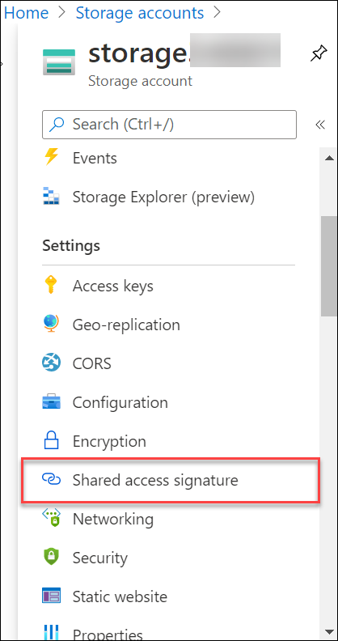

4.  On the Shared access signature page, under Allowed services, select Blob and File. Deselect Queue and Table.

     - Under Allowed resource types, select Service, Container, and Object.

     - Accept the default permissions, and start and expiry date/time values.

     - Leave Allowed protocols set to HTTPS only, and then click Generate SAS and connection string.

    

5.  **Make a note of the values in the SAS token, Blob service SAS URL, and File service SAS URL fields.** Copy these values to the clipboard, and paste them into a text file, using Notepad.

    

6.  Return to your desktop computer, and start Azure Storage Explorer.

    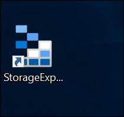

7.  In Azure Storage Explorer, expand Local & Attached, right-click Storage Accounts, and then select Connect to Azure Storage

    
    
    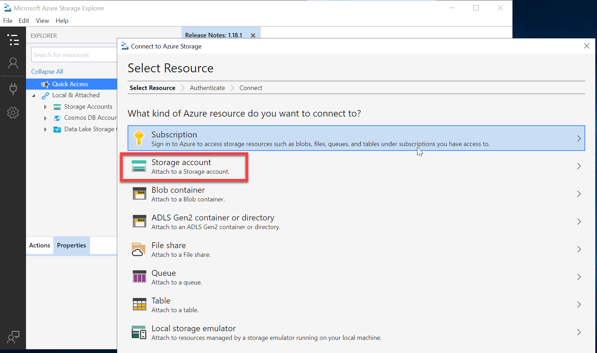

8.  In the Connect to Azure Storage dialog box, select **Shared access signature (SAS)**, and then select Next.

    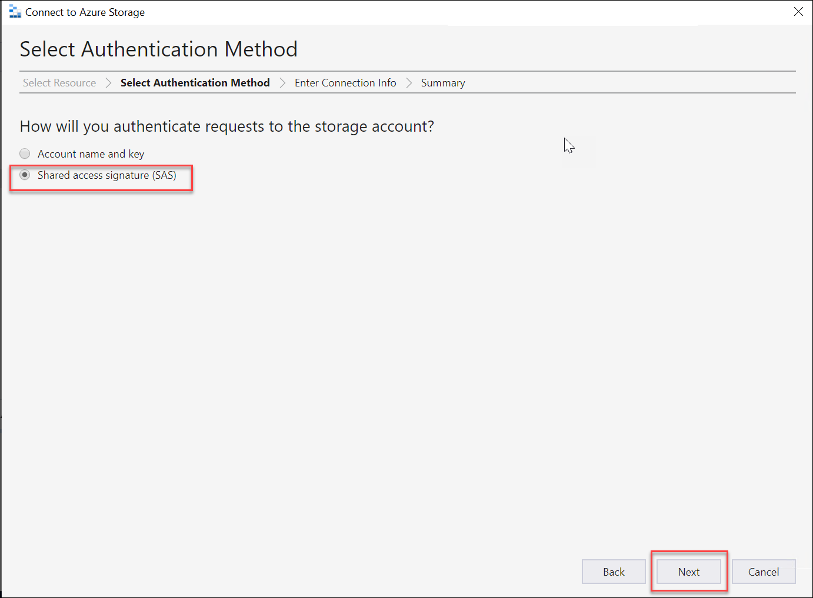

9.  On the Enter Connection Info page. In **SAS connection string OR service URL** field, provide the Blob service SAS URL that you generated earlier in the Azure portal which you have copied into a notepad, the Display name fields on this page will populate automatically and then select **Next**.

    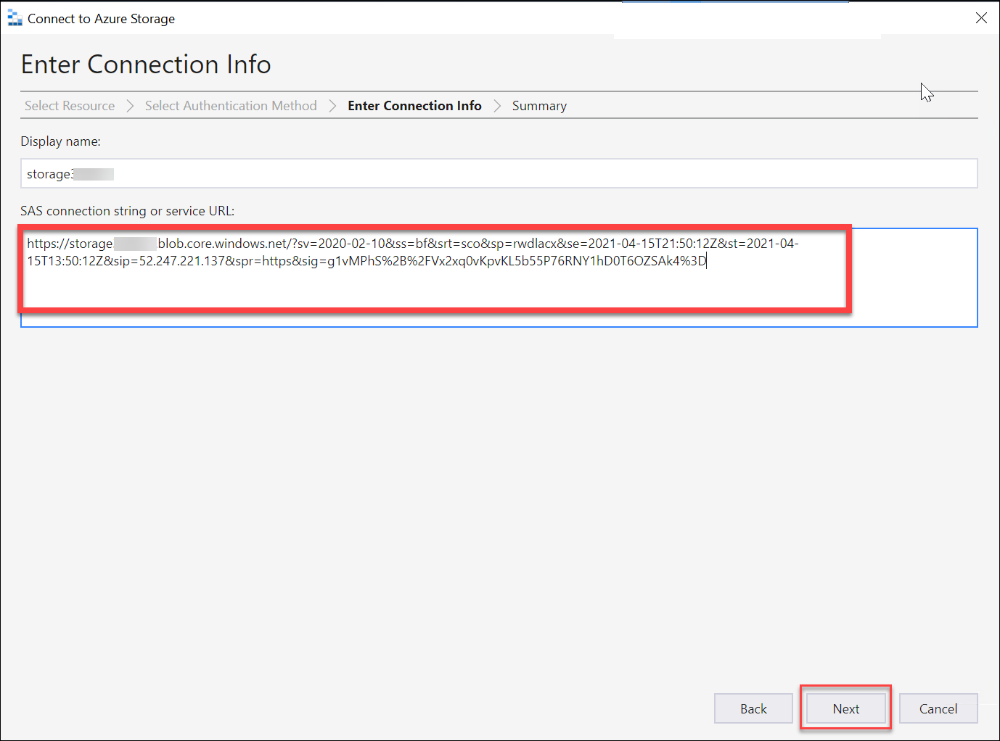

10.  On the Connection Summary page, select Connect.

     

11. In Azure Storage Explorer, under Storage Accounts, expand Storage{deploymentID}. Verify that folders appear for Blob Containers and File Shares.

   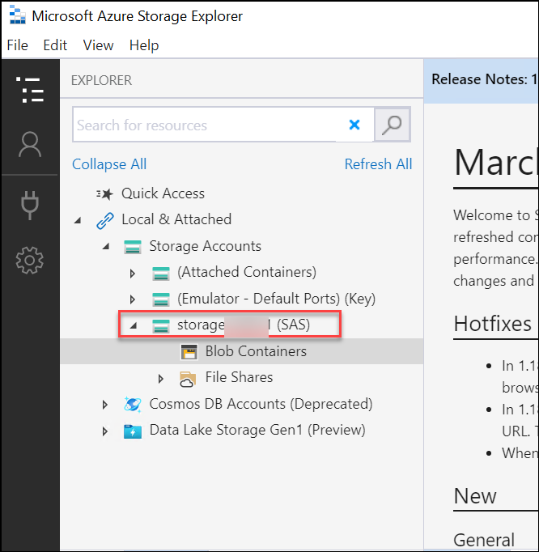

12. Right-click Blob Containers, and then select Create Blob Container. Add a container named images.

   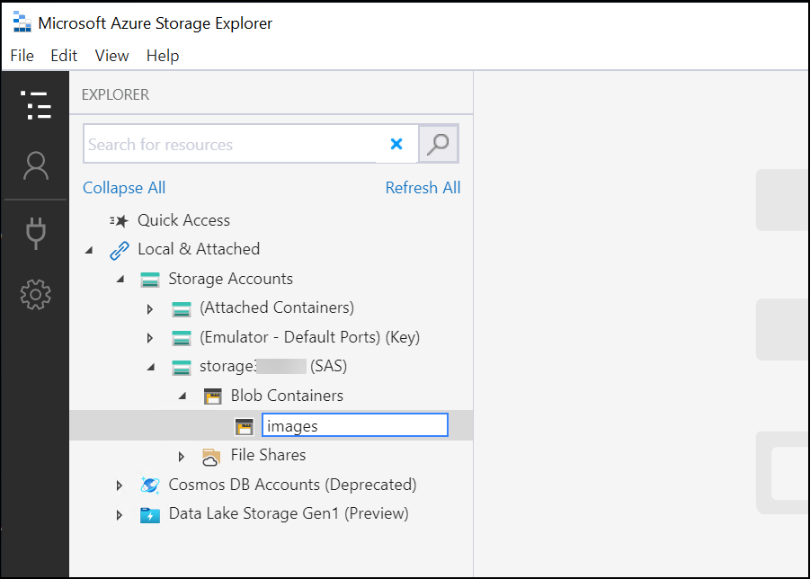

13. Return to the Azure portal and open Cloud Shell window and it will be your first time opening cloud shell and will be asked to enter bash or powershell,Select **bash** and then select **Show advanced settings**.

   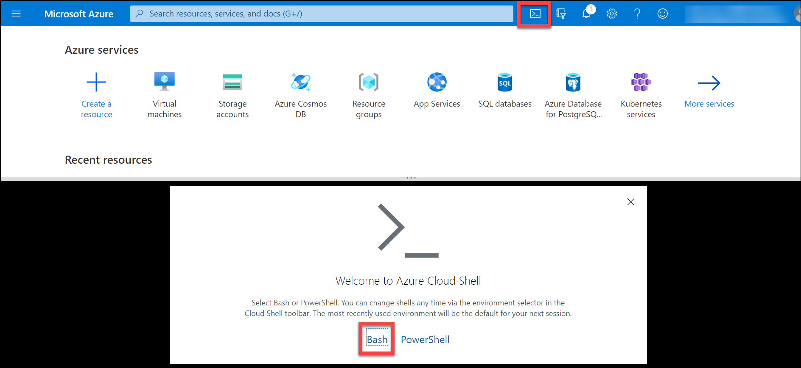
   
   

14. You have to create a storage account to run the bash commands and Select Use existing under Resource Group then select DP900-deploymentID and enter unique name for storage account name and Enter unique name and then click on **Create Storage**.

   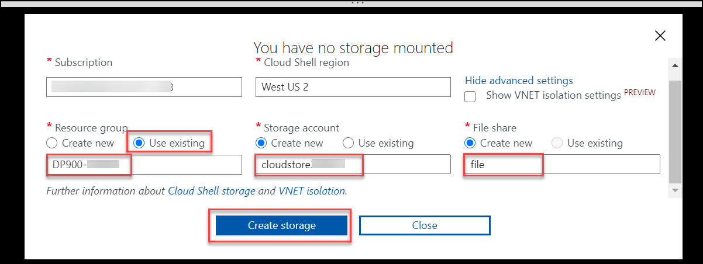

15. Run the following commands. In the second command Replace storage account name(including the <>) with the name of the storage account name you copied into notepad in the earlier steps of this task and then run the command and after the command is run you will see similar outputs as shown in image :

     ```
      git clone https://github.com/MicrosoftDocs/mslearn-explore-non-relational-data-stores-azure.git lab
    
       az storage blob upload-batch\
         --account-name <storage account name>\
         --source 'images'\
         --pattern '*.gif'\
         --destination 'images'

     ```

   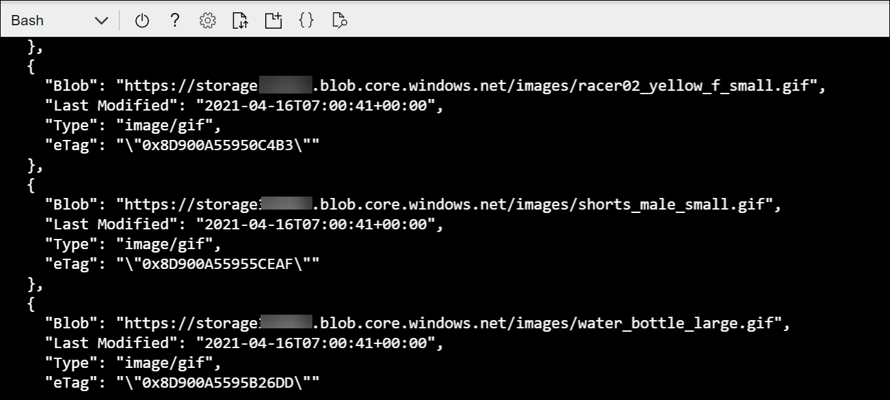
    This command uploads all the files in the images folder to the images blob container in your storage account.

  >**Note**: You may see a message that starts with *No connection string, account key or sas token found*. You can ignore this message.

### Task 4: View images in Azure Blob storage
---------------------------------

1.  Switch back to Azure Storage Explorer on your desktop computer.

2.  Select the images container to open it again. The container should now contain the image blobs for your products. if not able to find the images,please click on refresh as shown in the image.

   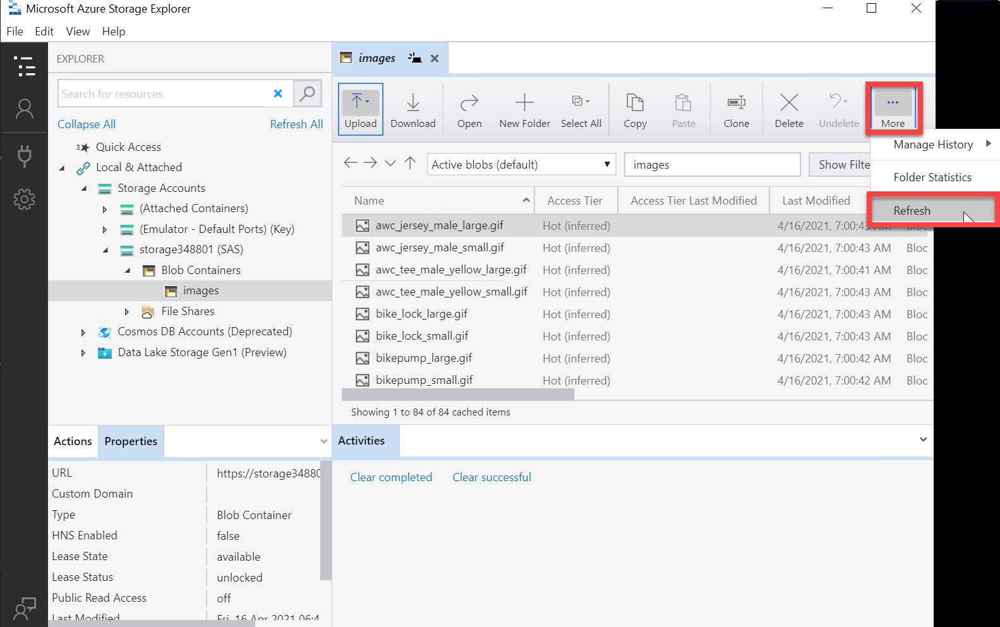

3.  Select any blob, and then select Open in the toolbar.

   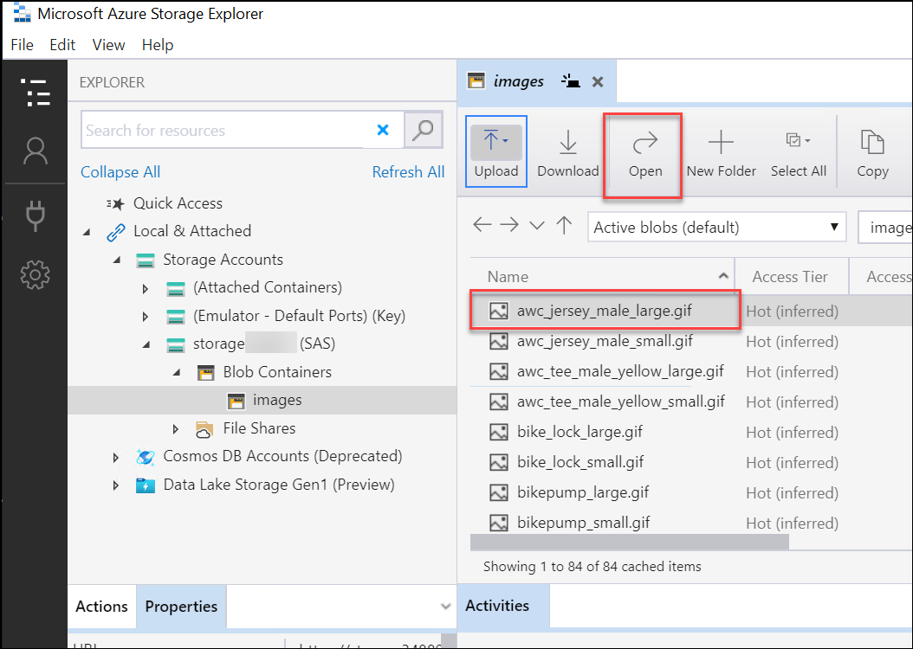

4.  The blob should be downloaded, and the contents displayed.

    

4.  If time allows, try downloading other images. You can also select multiple images and use the Download command in the toolbar to retrieve the image files from blob storage and save them locally.

### Task 5: Upload documents to Azure File storage
--------------------------------------

1.  In Azure Storage Explorer, in the left-hand pane, under storage{deployment-id} (SAS), right-click File Shares, and then select Create File Share. Add a file share named **documents**.

   

2.  Return to the azure portal and open the Cloud Shell window, and make sure you are in the labs folder. If not then enter **cd lab** command to enter into the lab folder

3.  Run the following command:

    ```
    bash findip.sh

    ```

    This command returns the public IP address of your Cloud Shell. Make a note of this address.

4.  Switch to the Azure portal and go to the page for your storage account starting with name **storage**.

5.  Under Settings, select Shared access signature, and create another SAS token, this time for your Cloud Shell. Specify the following settings, and then click Generate SAS and connection string:

    TABLE 2
    | Setting | Value |
    | --- | --- |
    | Allowed services | File |
    | Allowed reource types | Container, and Object |
    | Permissions | Accept the default permissions |
    | Start and expiry date/time | Accept the default values |
    | Allowed IP addresses | Enter the IP address that you noted in the step 3 of this task |
    | Allowed protocols | HTTPS only |

   
   
6. Make a note of the **SAS token** that is generated.

   

7.  Return to the Cloud Shell and run the following command. Replace <storage-account-name> with the name of your storage account, and replace <SAS-token> with the SAS token for your storage account that you generated in the previous step:

    ```
    azcopy copy 'docs' 'https://<storage-account-name>.file.core.windows.net/documents/productdocs<SAS-token>' --recursive

    ```

    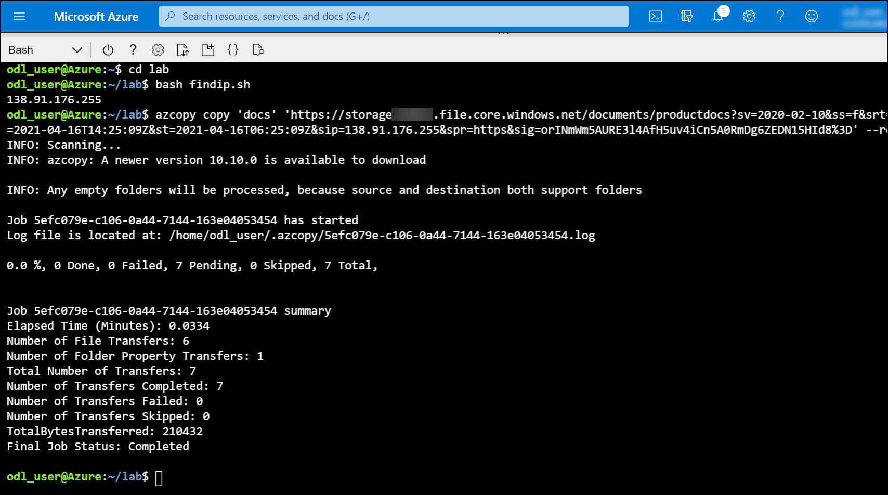
    This command uploads all the files in the *docs* folder to a folder named *productdocs* in the *documents* file share. It should upload seven items; one folder and six files.

### Task 6: Download documents from Azure File storage
------------------------------------------

1.  Return to Azure Storage Explorer on your desktop computer.

2.  Close the documents pane, and the select the documents file share to open it again. The productdocs folder should be listed in the right-hand pane.

3.  Double-click the productdocs folder, and then double-click the docs sub-folder. This sub-folder contains six documents:

    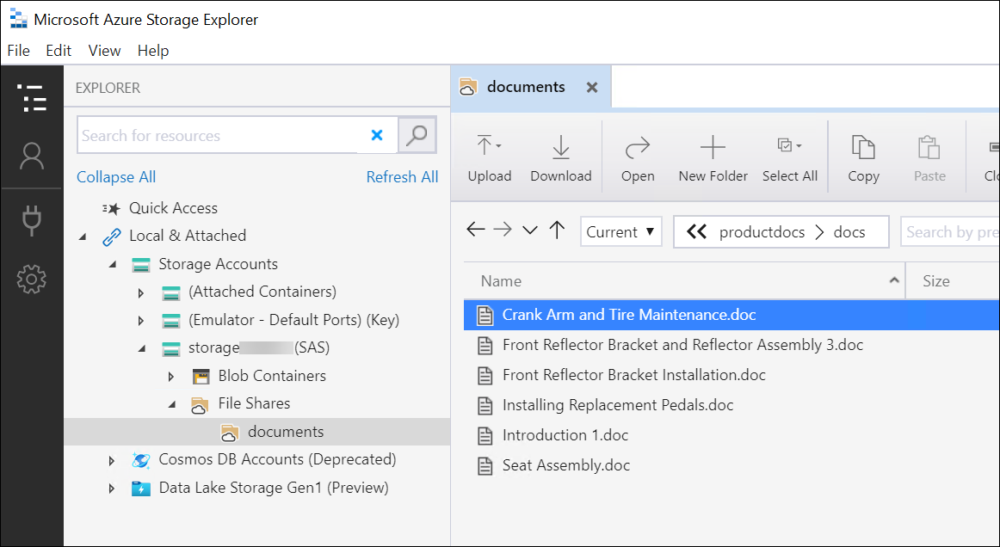

4.  Select any of the files, and then select Open. The file will be downloaded and opened using an editor. If you have Microsoft Word installed on your desktop, it will start and display the file, otherwise WordPad will be used (in this case, you should see the text, but the graphics images in the file won't display correctly).

    The example below shows the *Front Reflector Bracket and Reflector Assembly 3.doc* file.

    
