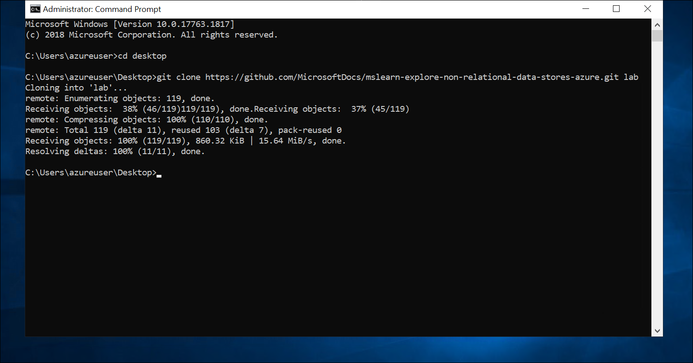
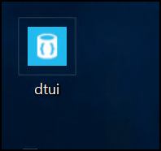

# Manage Azure Cosmos DB

In this exercise, you'll review how Cosmos DB stores data. Then you'll learn how to upload data to a Cosmos DB database, and configure Cosmos DB to support bulk loading.


### Task 1: Load data using the Cosmos DB Data Migration tool
--------------------------------

1.  Sign in to the [Azure portal](https://portal.azure.com/learn.docs.microsoft.com) using the credentials provided in the Environment details page from the left side.

2.  On the home page, select Azure Cosmos DB.

    

3.  On the Azure Cosmos DB page, select the Cosmos DB account with name cosmos{deploymentID} present in the page.

    

4.  On the Cosmos DB account page, under Settings, select Keys. Copy the PRIMARY CONNECTION STRING to the clipboard.

    

5.  Switch to your desktop computer.

6.  Open a command prompt window, navigate to desktop using the cd command, and run the second command to create another copy of the code and data required for the exercise.

       >**Note**: You need a copy of the data on your computer because you'll run the tools to upload this data from your desktop.

    ``` 
        cd desktop
        
        git clone https://github.com/MicrosoftDocs/mslearn-explore-non-relational-data-stores-azure.git lab

     ```

    
7.  On the desktop, Double-click the file dtui.exe. This application is the Data Migration Tool.

    

8.  On the Welcome page of the Data Migration Tool, select Next.

    

9. On the Source Information page, in the Import from drop-down list box, select JSON file(s). and then select Add Files.

    

10. In the Open dialog box, browse to the folder on the desktop where you cloned the repository containing the sample data for the exercise, move to the lab folder, move to the products folder, and select the productinfo.json file. Select Open.

    >Note: The productinfo.json file contains the product information in JSON format. If you have time, you can examine the contents of this file using Notepad.
   
    
11. Back on the Source Information page, select Next

12. On the Target Information page, enter the following settings, and then select Next.

    TABLE 1
    | Field | Value |
    | --- | --- |
    | Export to | Azure Cosmos DB - Sequential record import (partitioned collection) |
    | Connection String | Paste the primary connection string from the clipboard, and append the text *database=ProductData* to the end of the string, after the semi-colon ( ; ) character. |
    | Collection | ProductCatalog |
    | Partition Key | /productcategory/subcategory |
    | Collection Throughput | 1000 |
    | ID | *leave empty* |

    

13. On the Advanced page, leave all settings at their default values, and then select Next.

    

14. On the Summary page, select Import.

    

15. Wait while the import proceeds. It should complete without any errors or warnings, and report that it has transferred 504 records.

    
    
    >Note : If you find the import failed with  error, perform the steps from 9 to 15 again.

16. Close the Data Migration Tool.
