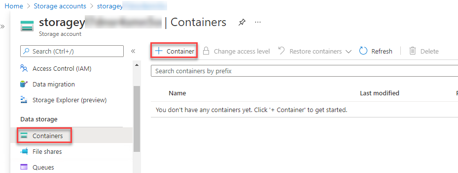
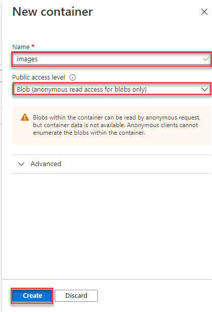
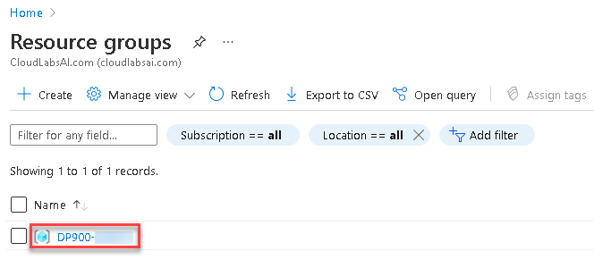
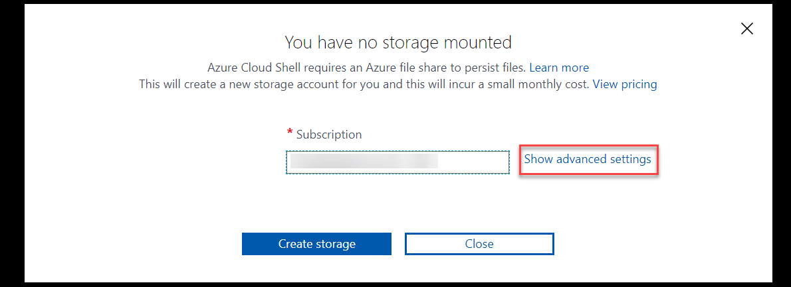

# Manage Azure Blob storage

In this exercise, you'll learn how to create and manage blobs, and the containers that hold them.


### Task 1: Create an Azure Storage container
--------------------------------
In an Azure storage account, you store blobs in containers. A container provides a convenient way of grouping related blobs together, and you can organize blobs in a hierarchy of folders inside a container, similar to files in a file system on disk.

You create a container in an Azure Storage account. You can do this using the Azure portal, or using the Azure CLI or Azure PowerShell from the command line.

#### Using Azure portal:

1.  In the Azure portal, in the left-hand navigation menu, select Home

    

2.  On the Home page, select Storage accounts, and then select the storage account present in the page that starts with the name **storage**. Copy the storage account name into a notepad for later tasks.

3.  On the Storage Account page, under **Data storage**, select **Containers**. On the Containers page, select **+ Container** to create a new container.

    

4. On the new container create page, provide name as **images** and select **blob** in **Public access level** dropdown. Click on create.

    

#### Using Azure CLI:

1. In the Azure portal, in the left-hand navigation menu select Home and scroll down for Navigate menu there select Resource Group. And copy the name of the Resource Group into a notepad for later tasks.

   
      

2. open Cloud Shell window and it will be your first time opening cloud shell and will be asked to enter bash or powershell,Select **bash** and then select **Show advanced settings**.

   
   
   

2. You have to create a storage account to run the bash commands and Select Use existing under Resource Group then select DP900-deploymentID and enter unique name for storage account name and Enter unique name and then click on **Create Storage**.

   

3. Run the following commands by replacing storage account name(including the <>) and Resource-group(including the <>) with the name of the storage account name and resource group name you copied into notepad in the earlier steps of this task and then run the command and after the command is run you will see similar outputs as shown in image :

     ```
        az storage container create \
          --name images-cli \
          --account-name <storage account name> \
          --resource-group <Resource-group> \
          --public-access blob
     ```

#### Using Azure PowerShell:

1. 
     ```
        Get-AzStorageAccount `
          -ResourceGroupName "<Resource-group>" `
          -Name "<storage account name>" | New-AzStorageContainer `
            -Name "images-ps" `
            -Permission Blob
     ```
