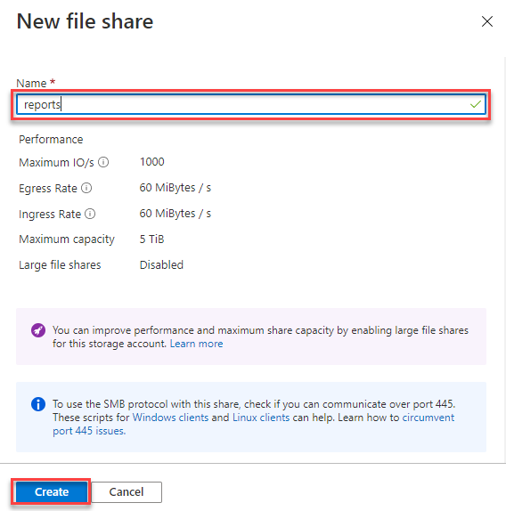
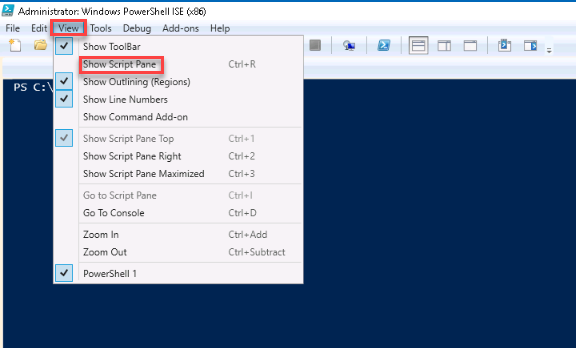
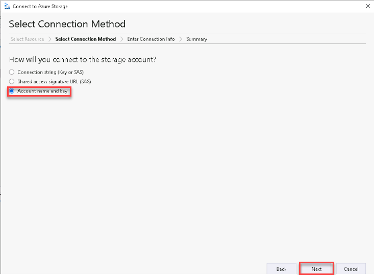
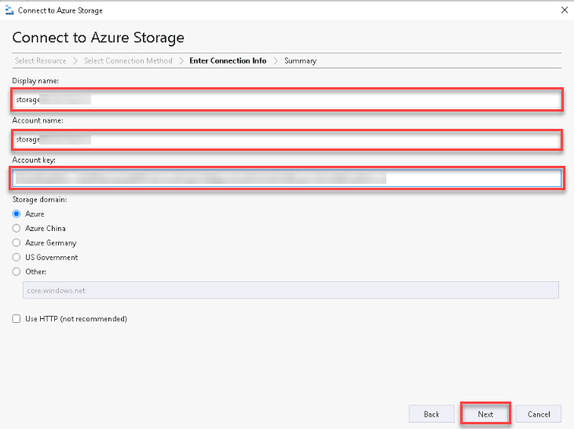
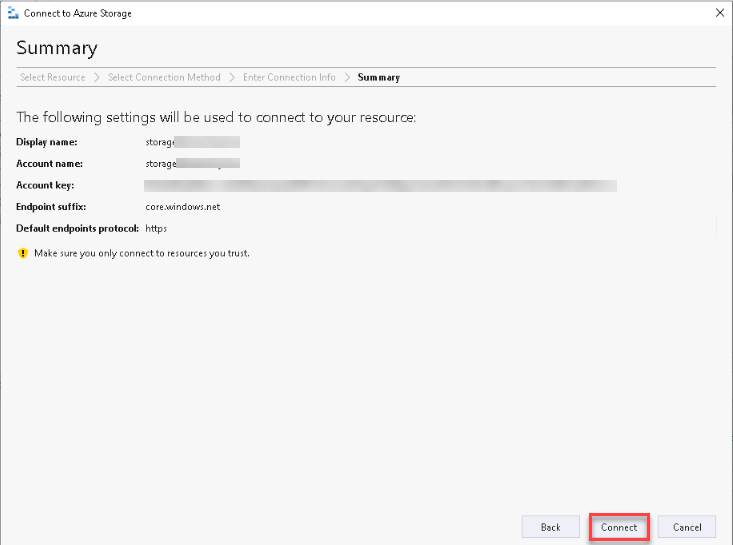

# Manage Azure File storage

In this exercise, you'll learn how to create and manage file shares, and upload and download files in Azure File storage.


# Task 1: Create a file share

Microsoft provides two graphical tools you can use to create and manage file shares in Azure Storage: the Azure portal, and Azure Storage Explorer.

## Using the Azure portal:

1. In the Azure portal, in the left-hand navigation menu, select Home

    

2. On the Home page, select Storage accounts, and then select the storage account present in the page that starts with the name **storage**. Copy the storage account name into a notepad for later tasks.

    

3. On the Storage Account page, under **Data storage**, select **File Shares**. On the File shares page, select **+ File share** to create a new file share.

    
    
4. On the New file share window give **Name** as **reports** then click on **create**.

    
    
5. After you've created a share, Click on **reports**. you can use the Azure portal to add directories to the share, upload files to the share, and delete the share. 

    

6. The Connect command generates a PowerShell script that you can run to attach to the share from your local computer. You can then use the share as though it was a local disk drive. Click on **Connect** and copy the **PowerShell** script.

    
    
        
    
7. Now in LabVM go to start menu and type **Powershell ISE** in search bar, then open it.

8. Go to View and click on show script pane to open editor panel. then paste the connection string you copied and click on execute button.

     
     
         
    
9. Now open windows explorer and verify mounted drive. You can upload and download files to the share using this mounted drive.

       

## Using Azure Storage Explorer

Azure Storage Explorer is a utility that enables you to manage Azure Storage accounts from your desktop computer.  You can use Storage Explorer to create blob containers and file shares, as well as upload and download files.

1.  In the Azure portal, in the left-hand navigation menu, select Home

    

1.  On the Home page, select Storage accounts, and then select the storage account present in the page that starts with the name **storage**. Copy the storage account name into a notepad for later tasks.

1.  On the Storage Account page, under **Security + networking**, select **Access Keys**.

    

1.  On the Access Keys page, Click on **show** under Key and copy and paste **Storage account name** and **key** to notepad.

    

1.  Return to your desktop computer, and start Azure Storage Explorer.

    

1.  In Azure Storage Explorer, expand Local & Attached, right-click Storage Accounts, and then select **Azure Storage**, In the popup window select **Storage account or service**

    
    
    

1.  In the Connect to Azure Storage dialog box, select **Account name and key**, and then select Next.

    

1.  On the Enter Connection Info page. In **Display name** and **Account name** fields, provide the **storage account name** and in **Account key** provide the key value which you have copied into a notepad, then select **Next**.

    

1.  On the Connection Summary page, select Connect.

     

1. In Azure Storage Explorer, under Storage Accounts, expand Storageaccount which you have used in the above steps. Verify that folders appear for Blob Containers and File Shares.

   

1. Right-click File Shares, and then select Create File Share. Add a file share named **documents**.

   

# Task 2: Upload and download files

## Using Azure cli

1.  Return to the azure portal and open the Cloud Shell window, and make sure to select **Bash** and  then enter **cd lab** command to enter into the lab folder
2.  Switch to the Azure portal and go to the page for your storage account starting with name **storage**.

3.  Under **Security + networking**, select **Shared access signature**, and create another SAS token, this time for your Cloud Shell. Specify the following settings, and then click Generate SAS and connection string:

    TABLE 2
    | Setting | Value |
    | --- | --- |
    | Allowed services | File |
    | Allowed reource types | Container, and Object |
    | Permissions | Accept the default permissions |
    | Start and expiry date/time | Accept the default values |
    | Allowed protocols | HTTPS only |

   
   
4. Make a note of the **SAS token** that is generated.

   

5.  Return to the Cloud Shell and run the following command. Replace <storage-account-name> with the name of your storage account, and replace <SAS-token> with the SAS token for your storage account that you generated in the previous step:

    ```
    azcopy copy 'docs' 'https://<storage-account-name>.file.core.windows.net/documents/productdocs<SAS-token>' --recursive

    ```

    
    This command uploads all the files in the *docs* folder to a folder named *productdocs* in the *documents* file share. It should upload seven items; one folder and six files.

6. To Download files from Azure file share run the following command. Replace <storage-account-name> with the name of your storage account, and replace <SAS-token> with the SAS token for your storage account that you generated in the previous step:

    ```
    azcopy copy 'https://<storage-account-name>.file.core.windows.net/documents/productdocs<SAS-token>' 'localfolder' --recursive

    ```        
    
## Using Storage Explorer

1.  Return to Azure Storage Explorer on your desktop computer.

2.  You can upload files to Documents folder using Upload button in the menu.
    
        
    
3.  Close the documents pane, and the select the documents file share to open it again. The productdocs folder should be listed in the right-hand pane.
    
4.  Double-click the productdocs folder, and then double-click the docs sub-folder. This sub-folder contains six documents:

    

5.  Select any of the files, and then select Open. The file will be downloaded and opened using an editor. If you have Microsoft Word installed on your desktop, it will start and display the file, otherwise WordPad will be used (in this case, you should see the text, but the graphics images in the file won't display correctly).

    The example below shows the *Front Reflector Bracket and Reflector Assembly 3.doc* file.

    
