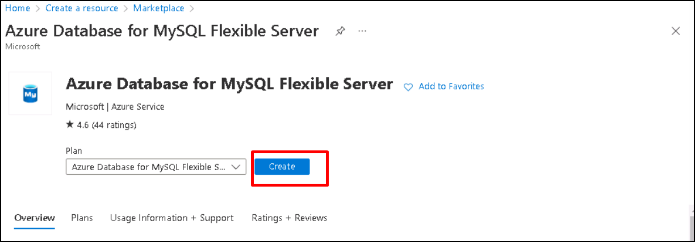

# Explore Azure Database for MySQL

In this exercise you'll provision an Azure Database for MySQL resource in your Azure subscription.

## Provision an Azure Database for MySQL resource

In this exercise, you'll provision an Azure Database for MySQL resource.

1. In the Azure portal, select **&#65291; Create a resource** from the upper left-hand corner and search for **Azure Database for MySQL**. From the marketplace select the **Azure Database for MySQ Flexible Server**.
 
    

1. On the **Azure Database for MySQ Flexible Server** select **Create**.
    

    

1. Enter the following values on the **Create SQL Database** page:
    - **Subscription**: Select your Azure subscription.
    - **Resource group**: Choose the existing resource group **dp-900-lab01b-<inject key="DeploymentID" enableCopy="false"/>**.
    - **Server name**: Enter a unique name.
    - **Region**: Any available location near you.
    - **MySQL Version**: Leave unchanged.
    - **Workload type**: For development or hobby projects.
    - **Compute + storage**: Leave unchanged.
    - **Availability zone**: Leave unchanged.
    - **Enable high availability**: Leave unchanged.
    - **Admin username**: Your name
    - **Password** and **Confirm password**: A suitably complex password

1. Select **Next: Networking**.

1. Under **Firewall rules**, select **&#65291; Add current client IP address**.

1. Select **Review + Create**, and then select **Create** to create your Azure MySQL database.

1. Wait for deployment to complete. Then go to the resource that was deployed, which should look like this:

    

1. Review the options for managing your Azure Database for MySQL resource.

**Congratulations** on completing the task! Now, it's time to validate it. Here are the steps:

 - Click the (...) icon located at the upper right corner of the lab guide section and navigate to the Lab Validation Page.
 
 - Hit the Validate button for the corresponding task.
 
 - If you receive a success message, you can proceed to the next task. If not, carefully read the error message and retry the step, following the instructions in the lab guide.
 
 - If you need any assistance, please contact us at labs-support@spektrasystems.com. We are available 24/7 to help you out.
