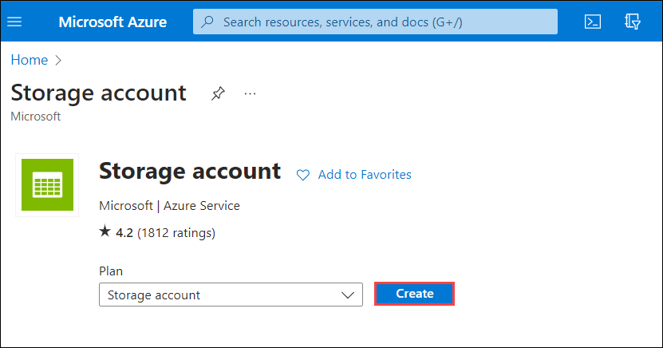
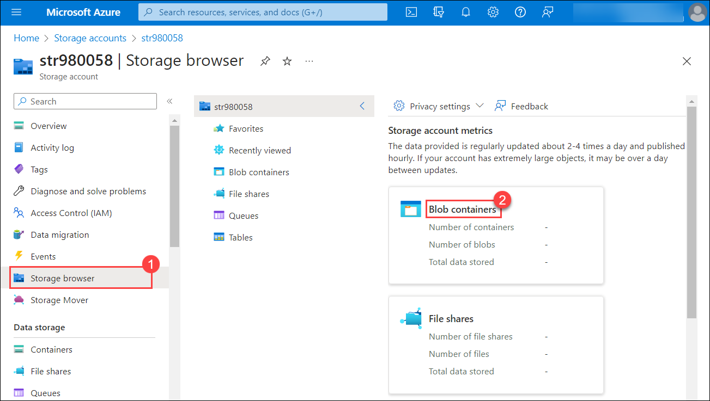
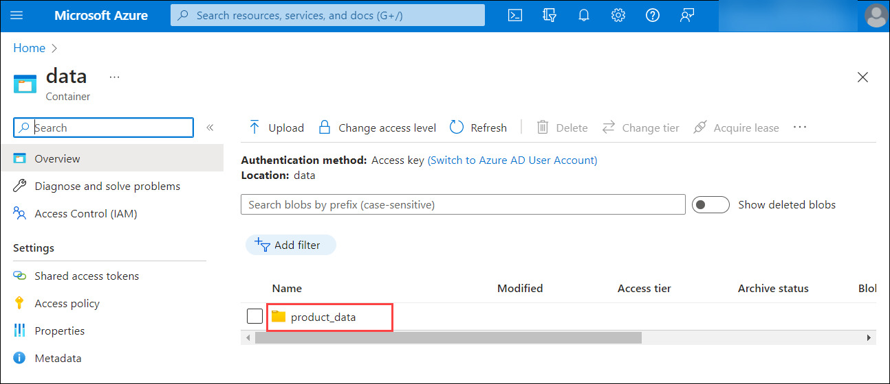
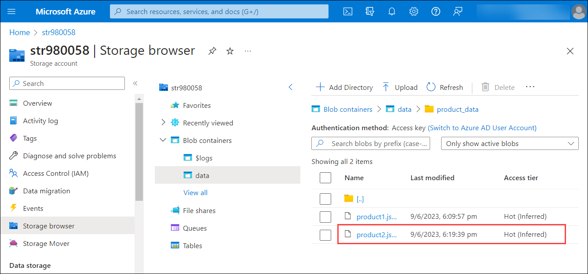
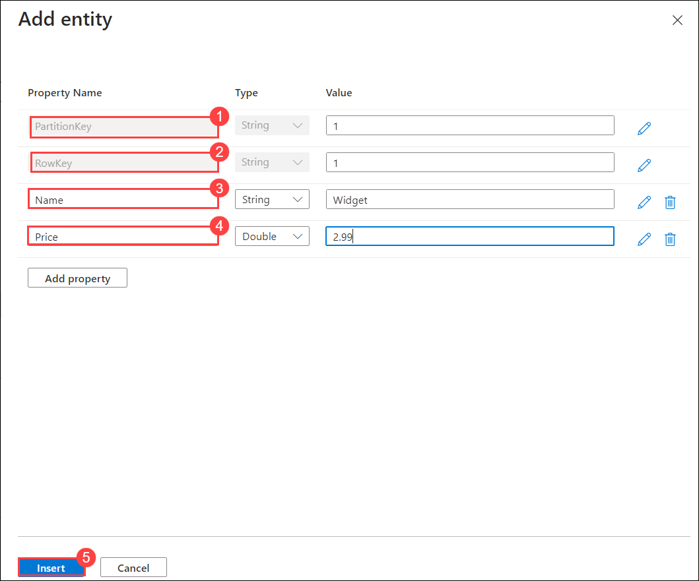
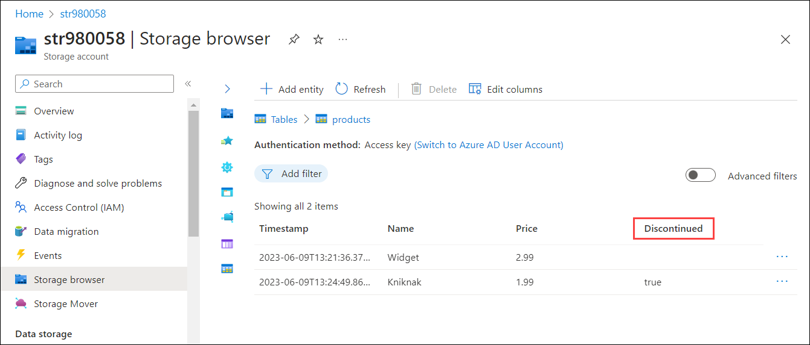

# Module 02: Explore Azure Storage

In this exercise you'll provision an Azure Storage account in your Azure subscription, and explore the various ways you can use it to store data.

## Explore Azure Storage

In this exercise you'll provision an Azure Storage account in your Azure subscription, and explore the various ways you can use it to store data.

## Exercise 1: Explore Azure Storage

#### Task 1: Provision an Azure Storage account

The first step in using Azure Storage is to provision an Azure Storage account in your Azure subscription.

1.  If you are not logged in already, click on the **Azure portal** shortcut that is available on the desktop and log in with the Azure credentials as shown below:
  
   - Username: <inject key="Username" enableCopy="false" />
   - Password: <inject key="Password" enableCopy="false" /> 
  
2.  On the Azure portal home page, select  **＋ Create a resource**  from the upper left-hand corner and search for  _Storage account_. Then in the resulting  **Storage account**  page, select  **Create**.

     
    
3.  Enter the following values on the  **Create a storage account**  page:
    
    -   **Subscription**: Select your Azure subscription.
    -   **Resource group**:Choose the existing resource group **DP-900-Module2-<inject key="DeploymentID" enableCopy="false"/>**
    -   **Storage account name**: **str<inject key="DeploymentID" enableCopy="false"/>**.
    -   **Region**: Select any available location.
    -   **Performance**:  _Standard_
    -   **Redundancy**:  _Locally-redundant storage (LRS)_

4.  Select  **Next: Advanced >**  and view the advanced configuration options. Then select  **Next: Networking >**  to view the networking options for your storage account.
    
5.  Select  **Next: Data protection >**  and then in the  **Recovery**  section,  deselect all of the  **Enable soft delete...**  options. These options retain deleted files for subsequent recovery, but can cause issues later.
    
6.  Continue through the remaining  **Next >**  pages without changing any of the default settings, and then on the  **Review**  page, wait for your selections to be validated and select  **Create**  to create your Azure Storage account.
    
7.  Wait for deployment to complete. Then go to the resource that was deployed.
    

#### Task 2 : Explore blob storage

Now that you have an Azure Storage account, you can create a container for blob data.

1.   Download the product1.json JSON file from https://aka.ms/product1.json and save it on your computer (you can save it in any folder - you'll upload it to blob storage later).
    
      >**Note:** If the JSON file is displayed in your browser, save the page as **product1.json**.
    
2.  In the Azure portal page go to the newly created storage account for your storage container, on the left side, in the  **Data storage**  section, select  **Containers**.
    
3.  In the  **Containers**  page, select  **＋ Container**  and add a new container named  **data**  with a public access level of  **Private (no anonymous access)**.
    
4.  When the  **data**  container has been created, verify that it's listed in the  **Containers**  page.
    
5.  Go back to the storage account, in the pane on the left side, in the top section, select  **Storage browser**. This page provides a browser-based interface that you can use to work with the data in your storage account.
    
6.  In the storage browser page, select  **Blob containers**  and verify that your  **data**  container is listed.

         
    
7.  Select the  **data**  container, and note that it's empty.
    
8.  Select  **＋ Add Directory**  and read the information about folders before creating a new directory named  **products**.
    
9.  In storage explorer, verify that the current view shows the contents of the  **products**  folder you just created - observe that the "breadcrumbs" at the top of the page reflect the path  **Blob containers > data > products**.

10. In the breadcrumbs, select **data** to switch to the **data** container, and note that it does <u>not</u> contain a folder named **products**.

    >**Note:** Folders in blob storage are virtual, and only exist as part of the path of a blob. Since the **products** folder contained no blobs, it isn't really there!
      
10.  Use the  **⤒ Upload**  button to open the  **Upload blob**  panel.
    
11.  In the  **Upload blob**  panel, select the  **product1.json**  file you saved on your local computer previously. Then in the  **Advanced**  section, in the  **Upload to folder**  box, enter  **product_data**  and select the  **Upload**  button.
    
12.  Close the  **Upload blob**  panel if it's still open, and verify that a  **product_data**  virtual folder has been created in the  **data**  container.
    
13.  Select the  **product_data**  folder and verify that it contains the  **product1.json**  blob you uploaded.
   
14.  On the left side, in the  **Data storage**  section, select  **Containers**.
    
15.  Open the  **data**  container, and verify that the  **product_data**  folder you created is listed.

     
    
16.  Select the  **‧‧‧**  icon at the right-end of the folder, and note that it doesn't display any options. Folders in a flat namespace blob container are virtual, and can’t be managed.
    
17.  Use the  **X**  icon at the top right in the  **data**  page to close the page and return to the  **Containers**  page.
    

#### Task 3 :  Explore Azure Data Lake Storage Gen2

Azure Data Lake Store Gen2 support enables you to use hierarchical folders to organize and manage access to blobs. It also enables you to use Azure blob storage to host distributed file systems for common big data analytics platforms.

1.  Download the product2.json JSON file from https://aka.ms/product2.json and save it on your computer in the same folder where you downloaded product1.json previously - you'll upload it to blob storage later.

2. In the pane on the left side, in the top section, select  **Storage browser**  and navigate back to the root of your  **data**  blob container, which still contains the  **product_data**  folder.

3.  Select the  **product_data**  folder, and verify it still contains the  **product1.json**  file you uploaded previously.

4.  Use the  **⤒ Upload**  button to open the  **Upload blob**  panel.

5.  In the  **Upload blob**  panel, select the  **product2.json**  file you saved on your local computer. Then select the  **Upload**  button.

6.  Close the  **Upload blob**  panel if it's still open, and verify that a  **product_data**  folder now contains the  **product2.json**  file.

     

7.  On the left side, in the  **Data storage**  section, select  **Containers**.

8.  Open the  **data**  container, and verify that the  **product_data**  folder you created is listed.

9.  Select the  **‧‧‧**  icon at the right-end of the folder, and note that with hierarchical namespace enabled, you can perform configuration tasks at the folder-level; including renaming folders and setting permissions.

10.  Use the  **X**  icon at the top right in the  **data**  page to close the page and return to the  **Containers**  page.

### Task 4 :  Explore Azure Files

Azure Files provides a way to create cloud-based file shares.

1.  In the Azure portal displaying the storage container, on the left side, in the  **Data storage**  section, select  **File shares**.

2.  In the File shares page, select  **＋ File share**  and add a new file share named  **files**  using the  **Transaction optimized**  tier and select **Create**.

3.  In the  **File shares**, open your new  **files**  share.

4.  At the top of the page, select  **Connect**. Then in the  **Connect**  pane, note that there are tabs for common operating systems (Windows, Linux, and macOS)    that contain scripts you can run to connect to the shared folder from a client computer.

5.  Close the  **Connect**  pane and then close the  **files**  page to return to the  **File shares**  page for your Azure storage account.

### Task 5 : Explore Azure Tables

Azure Tables provide a keyvalue store for applications that need to store data values, but don't need the full functionality and structure of a relational database.

1.  In the Azure portal page for your storage container, on the left side, in the  **Data storage**  section, select  **Tables**.
    
2.  On the  **Tables**  page, select  **＋ Table**  and create a new table named  **products**.
    
3.  After the  **products**  table has been created, in the pane on the left side, in the top section, select  **Storage browser**.
    
4.  In storage explorer, select  **Tables**  and verify that the  **products**  table is listed.
    
5.  Select the  **products**  table.
    
6.  In the  **product**  page, select  **＋ Add entity**.
    
7.  In the  **Add entity**  panel, enter the following key values:

    |Property name | Type | Value |
    | ------------ | ---- | ----- |
    | PartitionKey (1) | String | 1 |
    | RowKey (2) | String | 1 |
    
8.  Select  **Add property**, and create a new property with the following values:
    
    |Property name | Type | Value |
    | ------------ | ---- | ----- |
    | Name (3) | String | Widget |
    
9.  Add a second property with the following values:
    
     |Property name | Type | Value |
     | ------------ | ---- | ----- |
     | Price (4) | Double | 2.99 |

    
10.  Select  **Insert (5)**  to insert a row for the new entity into the table.

     
    
11.  In storage browser, verify that a row has been added to the  **products**  table, and that a  **Timestamp**  column has been created to indicate when the row was last modified.
    
12. Add another entity to the **products** table with the following properties:

    |Property name | Type | Value |
    | ------------ | ---- | ----- |
    | PartitionKey | String | 1 |
    | RowKey | String | 2 |
    | Name | String | Kniknak |
    | Price | Double | 1.99 |
    | Discontinued | Boolean | true |

13. After inserting the new entity, verify that a row containing the discontinued product is shown in the table.

     
    
   You have manually entered data into the table using the storage browser interface. In a real scenario, application developers can use the Azure Storage Table API to build applications that read and write values to tables, making it a cost effective and scalable solution for NoSQL storage.

   > **Congratulations** on completing the task! Now, it's time to validate it. Here are the steps:
   > - Click Lab Validation tab located at the upper right corner of the lab guide section and navigate to the Lab Validation Page.
   > - Hit the Validate button for the corresponding task.If you receive a success message, you can proceed to the next task. 
   > - If not, carefully read the error message and retry the step, following the instructions in the lab guide.
   > - If you need any assistance, please contact us at labs-support@spektrasystems.com. We are available 24/7 to help you out.

### You have successfully completed this lab.
